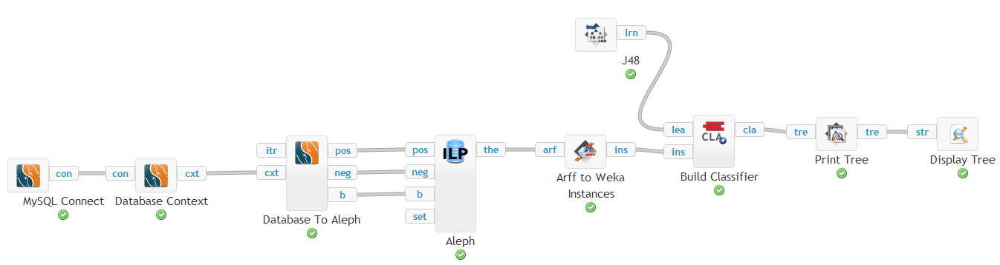

User documentation
==================

Tutorial
--------
A good starting point for getting to know ClowdFlows is the `interactive tutorial <http://clowdflows.org/editor/?tutorial=1>`_. It introduces the main concepts and actions needed for building workflows in ClowdFlows:

* Widget repository
* Widget inputs, outputs, parameters
* Arranging widgets on the canvas
* Connecting widgets into a workflow
* Executing a workflow

Decision support widgets
------------------------

Widgets in ClowdFlows are organized into categories, based on their purpose. One such category is the `decision support category <../user_doc_bycategory.html#category-decision-support>`_ which includes the following widgets:

* Weighted sum model, implementing a simple decision support model,
* Sensitivity analysis, offering the mechanism to see how each alternative's score changes while changing the importance of one attribute,
* Decision support charts, implementing several charts, which are useful for making reports and overviewing the data.

An example workflow is shown below.

.. figure:: ../images/dec_supp.png
    :target: http://clowdflows.org/workflow/383/

*Click the image to open the ClowdFlows workflow.*

ILP/RDM widgets
---------------

The `ILP/RDM category contains <../user_doc_bycategory.html#category-ilp>`_ widgets enabling inductive logic programming (ILP) and relational data mining (RDM).
The aim of these widgets is to make relational learning and inductive logic programming approaches publicly accessible.
They provide an easy-to-use interface to several relational learning algorithms and provide data access to several relational database management systems.

The figure below shows an example workflow that demonstrates the usage of RDM widgets in Clowdflows.
More specifically, the workflow constructs a decision tree on the Michalski Trains dataset (stored in a MySQL database) using Aleph to propositionalize the dataset.

*Click the image to open the ClowdFlows workflow.*

Complete list of categories and widgets
---------------------------------------

A `complete list <../user_doc_bycategory.html>`__ of categories and widgets is also available.

