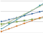

ClowdFlows user documentation
=============================

This part provides the user documentation for ClowdFlows widgets. 
It presents every widget along with its description and the list of inputs, outputs and parameters.
Where appropriate, the values that could be chosen from, as well as the default value are given.
Finally, the documentation provides example usage of widgets, by showing a public workflow which includes the widget.


Category Big data
-----------------
Category Classification
~~~~~~~~~~~~~~~~~~~~~~~

Widget: Naive Bayes
````````````````````

Naive Bayes with MapReduce

Algorithm calculates multinomial distribution for discrete features and Gaussian distribution for numerical features. The output of algorithm is consistent with implementation of Naive Bayes classifier in Orange and scikit-learn.

Reference:
MapReduce version of algorithm is proposed by Cheng-Tao Chu; Sang Kyun Kim, Yi-An Lin, YuanYuan Yu, Gary Bradski, Andrew Ng, and Kunle Olukotun. "Map-Reduce for Machine Learning on Multicore". NIPS 2006.

* Input: Dataset
* Output: Fit model (Fit model URL)
* Example usage: `Naive Bayes - lymphography <http://clowdflows.org/workflow/2729/>`_


Widget: Gaussian Naive Bayes predict
`````````````````````````````````````

* Input: Fit Model (Fit Model URL)
* Input: Dataset
* Parameter: Log probabilities (Calculate logarithm probabilities.)
* Output: Results


Widget: Linear SVM
```````````````````

Linear proximal SVM with MapReduce

Algorithm builds a model with continuous features and predicts binary target label (-1, 1). 

Reference
Algorithm is proposed by Glenn Fung, O. L. Mangasarian. Incremental Support Vector Machine Classification. Description of algorithm can be found at ftp://ftp.cs.wisc.edu/pub/dmi/tech-reports/01-08.pdf.

* Input: Dataset
* Parameter: The weighting factor
* Output: Fit model (Fit model URL)
* Example usage: `Linear SVM - sonar <http://clowdflows.org/workflow/2799/>`_


Widget: Linear proximal SVM predict
````````````````````````````````````

* Input: Fit model (Fit model URL.)
* Input: Dataset
* Output: Results


Widget: Logistic regression
````````````````````````````

Logistic regression with MapReduce

Algorithm builds a model with continuous features and predicts binary target variable (1, 0). Learning is done by fitting theta parameters to the training data where the likelihood function is optimized by using Newton-Raphson to update theta parameters. The output of algorithm is consistent with implementation of logistic regression classifier in Orange.

Reference:
MapReduce version of algorithm is proposed by Cheng-Tao Chu; Sang Kyun Kim, Yi-An Lin, YuanYuan Yu, Gary Bradski, Andrew Ng, and Kunle Olukotun. "Map-Reduce for Machine Learning on Multicore". NIPS 2006.

* Input: Dataset
* Parameter: Convergence (The value defines the convergence of the logistic regression.)
* Parameter: Max. number of iterations (Define a maximum number of iterations. If the cost function converges it will stop sooner.)
* Output: Fit model (Fit model URL)
* Example usage: `Logistic regression - sonar <http://clowdflows.org/workflow/2801/>`_


Widget: Logistic regression predict
````````````````````````````````````

The logistic regression classifier is a binary classifier that uses numeric features. The classifier learns by fitting theta parameters to the training data using Newton-Raphson method to update theta parameters.

* Input: Fit model (Fit model URL.)
* Input: Dataset
* Output: Results


Widget: Multinomial Naive Bayes fit
````````````````````````````````````

The NB classifier uses discrete features. The NB estimates conditional probabilities P(x_j = k|y = c) and prior probabilities P(y) from the training data, where k denotes the value of discrete feature x_j and c denotes a training label.

* Input: Dataset
* Output: Fit model (Fit model URL)


Widget: Multinomial Naive Bayes predict
````````````````````````````````````````

The NB classifier uses discrete features. The NB estimates conditional probabilities P(x_j = k|y = c) and prior probabilities P(y) from the training data, where k denotes the value of discrete feature x_j and c denotes a training label.

* Input: Fit model (Fit model URL.)
* Input: Dataset
* Parameter: m (Laplace Smoothing parameter.)
* Output: Results

Category Ensembles
~~~~~~~~~~~~~~~~~~

Widget: Distributed Random Forest
``````````````````````````````````

Distributed Random Forest

Fit phase
Random forest algorithm builds multiple decision trees with a bootstrap method on a subset of data. 
In each tree node, it estimates sqrt(num. of attributes)+1 randomly selected attributes (without replacement).
All decision trees are merged in large ensemble.  

Predict phase
Algorithm queries as many trees as needed for reliable prediction.
Firstly, it randomly chooses without replacement 15 trees. If all trees vote for the same class, it outputs prediction. If there are multiple classes predicted, it chooses 15 trees again. Algorithm calculates difference in probability between most and second most probable prediction. If difference is greater than parameter diff, it outputs prediction. If a test sample is hard to predict (difference is never higher than diff), it queries whole ensemble to make a prediction.

Reference
Similar algorithm is proposed in: Justin D Basilico, M Arthur Munson, Tamara G Kolda, Kevin R Dixon, and W Philip Kegelmeyer. Comet: A recipe for learning and using large ensembles on massive data.

* Input: Dataset
* Parameter: Trees per subset (Number of trees per subset of data)
* Parameter: Max tree nodes (Max. number of decision tree nodes)
* Parameter: Min samples split (Min. number of samples to split the node)
* Parameter: Class majority (Purity of a subset.)
* Parameter: Measure (Select measure for estimation of attributes.)

  * Possible values: 

    * Information gain
    * Minimum description length
* Parameter: Discretization (Select equal frequency discretization or random discretization for numeric attributes)

  * Possible values: 

    * Equal frequency discretization
    * Random discretization
* Parameter: Random state (Define a random state)
* Output: Fit model (Fit model URL)
* Example usage: `Random forest - segmentation <http://clowdflows.org/workflow/2731/>`_


Widget: Distributed Weighted Forest
````````````````````````````````````

Distributed Weighted Forest

Weighted forest is a novel ensemble algorithm. 

Fit phase
Weighted forest algorithm builds multiple decision trees with a bootstrap method on a subset of data. In each tree node, it estimates sqrt(num. of attributes)+1 randomly selected attributes (without replacement). It uses decision tree to predict out-of-bag samples. For each prediction of an out-of-bag sample, it measures margin (classifier confidence in prediction) and leaf identifier that outputs prediction. Algorithm uses similarity matrix, where it stores similarities for each out-of-bag sample that was predicted with the same leaf. We assume that samples are similar, if the same leaf predicts them multiple times in multiple decision trees. 
After algorithm builds all decision trees, it passes similarity matrix to k-medoids algorithm. Similarity matrix presents distances between test samples. We set parameter k as sqrt(num. of attributes)+1. k-medoids algorithm outputs medoids, which are test samples in the cluster centers of the dataset. Medoids are actual samples in a dataset, unlike centroids which are centers of clusters. Algorithm measures average margin for all samples that are in the cluster of certain medoid. It saves the average margin of a decision tree in its model. Algorithm uses this scores as weights of decision trees in predict phase.
Algorithm builds a forest on each subset of the data and it merges them in large ensemble. Each forest has its own medoids.

Predict phase 
Algorithm selects a forest (or more, if it finds equal similarities with medoids in multiple forests), that contain most similar medoid with a test sample. Then it uses the same procedure like with small data. Algorithm calculates Gower similarity coefficient with a test sample and every medoid. Only decision trees with high margin on similar test samples output prediction and algorithm stores decision tree margin for each prediction. Algorithm calculates final values for each prediction: (number of margins) * avg(margins) and it selects prediction with highest value.

* Input: Dataset
* Parameter: Trees per subset (Number of trees per subset of data)
* Parameter: Max tree nodes (Max. number of decision tree nodes)
* Parameter: Min samples split (Min. number of samples to split the node)
* Parameter: Class majority (Purity of a subset.)
* Parameter: Measure (Select measure for estimation of attributes.)

  * Possible values: 

    * Information gain
    * Minimum description length
* Parameter: Discretization (Select equal frequency discretization or random discretization for numeric attributes)

  * Possible values: 

    * Equal frequency discretization
    * Random discretization
* Parameter: Random state (Define a random state)
* Output: Fit model (Fit model URL)
* Example usage: `Weighted forest - lymphography <http://clowdflows.org/workflow/2797/>`_


Widget: Forest of Distributed Decision Trees
`````````````````````````````````````````````

Forest of Distributed Decision Trees

Fit phase
The forest of Distributed Decision Trees constructs decision tree on a subset of data and it estimates all attributes in every tree node.

Predict phase
Each tree votes and algorithm selects prediction with most votes.

Reference
Similar algorithm is proposed in Gongqing Wu, Haiguang Li, Xuegang Hu, Yuanjun Bi, Jing Zhang, and Xindong Wu. MRec4.5: C4. 5 ensemble classification with mapreduce.

* Input: Dataset
* Parameter: Trees per subset (Number of trees per subset of data)
* Parameter: Max tree nodes (Max. number of decision tree nodes.)
* Parameter: Bootstrap sampling
* Parameter: Min samples to split (The minimum number of samples required to split an internal node)
* Parameter: Min samples in leaf (The minimum number of samples in newly created leaves. A split is discarded if after the split, one of the leaves would contain less then min samples leaf samples)
* Parameter: Class majority (Purity of a subset.)
* Parameter: Measure (Select measure for estimation of attributes.)

  * Possible values: 

    * Information gain
    * Minimum description length
* Parameter: Discretization accuracy (Continuous attributes are converted to discrete intervals. For exact estimation use 0 (slowest) or increase the number to get an approximation (faster).)
* Parameter: Separate most present class
* Parameter: Random state
* Output: Fit model (Fit model URL)
* Example usage: `Decision trees - lymphography <http://clowdflows.org/workflow/2727/>`_

Category Clustering
~~~~~~~~~~~~~~~~~~~

Widget: k-means
````````````````

kmeans with MapReduce

The k-means is a partitional clustering technique that attempts to find a user-specified number of clusters k represented by their centroids.

* Input: Dataset
* Parameter: Number of clusters
* Parameter: Max number of iterations
* Parameter: Random state (Define a random state)
* Output: Fit model (Fit model URL)
* Example usage: `k-means - segmentation <http://clowdflows.org/workflow/2811/>`_


Widget: k-Means predict
````````````````````````

* Input: Fit model (Fit Model URL)
* Input: Dataset
* Output: Results

Category Regression
~~~~~~~~~~~~~~~~~~~

Widget: Linear regression
``````````````````````````

Linear regression with MapReduce

The linear regression fits theta parameters to training data.

Reference:
MapReduce version of algorithm is proposed by Cheng-Tao Chu; Sang Kyun Kim, Yi-An Lin, YuanYuan Yu, Gary Bradski, Andrew Ng, and Kunle Olukotun. "Map-Reduce for Machine Learning on Multicore". NIPS 2006.

* Input: Dataset
* Output: Fit model (Fit model URL)
* Example usage: `Linear regression - linear <http://clowdflows.org/workflow/2815/>`_


Widget: Linear regression predict
``````````````````````````````````

The linear regression fits theta parameters to training data.

* Input: Fit model (Fit model URL.)
* Input: Dataset
* Output: Results


Widget: Locally weighted regression
````````````````````````````````````

Locally weighted linear regression with MapReduce

Reference:
MapReduce version of algorithm is proposed by Cheng-Tao Chu; Sang Kyun Kim, Yi-An Lin, YuanYuan Yu, Gary Bradski, Andrew Ng, and Kunle Olukotun. "Map-Reduce for Machine Learning on Multicore". NIPS 2006.

* Input: Training dataset (Define training dataset)
* Input: Fitting dataset (Define a dataset that will be fitted to training dataset.)
* Parameter: Tau (Parameter Tau controls how quickly the weight of a training example falls off with distance of its x(i) from the query point x)
* Output: Results

Category Evaluation
~~~~~~~~~~~~~~~~~~~

Widget: Apply Classifier
`````````````````````````

Widget takes a model on input and applies it on test data

* Input: Fit Model (Fit Model URL)
* Input: Dataset (dataset)
* Parameter: Naive Bayes - m estimate (m estimate)
* Parameter: Random forest - difference (Random forest calculates difference in probability between most and second most probable prediction. If difference is greater than parameter diff, it outputs prediction. If a test sample is hard to predict (difference is never higher than diff), it queries whole ensemble to make a prediction.)
* Parameter: Random forest  - random state (Define a random state for predict phase.)
* Output: Results
* Example usage: `Decision trees - lymphography <http://clowdflows.org/workflow/2727/>`_


Widget: Classification Accuracy
````````````````````````````````

* Input: Results
* Input: Dataset
* Outputs: Popup window which shows widget's results
* Example usage: `Decision trees - lymphography <http://clowdflows.org/workflow/2727/>`_


Widget: Mean squared error
```````````````````````````

* Input: Results
* Input: Dataset
* Outputs: Popup window which shows widget's results
* Example usage: `Linear regression - linear <http://clowdflows.org/workflow/2815/>`_

Category Utilities
~~~~~~~~~~~~~~~~~~

Widget: Model View
```````````````````

Widget takes a model on input and saves to a file that user can review.

* Input: Fit Model (Fit Model URL)
* Outputs: Popup window which shows widget's results
* Example usage: `Decision trees - lymphography <http://clowdflows.org/workflow/2727/>`_


Widget: Class distribution
```````````````````````````

Widget measures distribution of classes in subsets of data.

* Input: Dataset
* Outputs: Popup window which shows widget's results
* Example usage: `Naive Bayes - lymphography <http://clowdflows.org/workflow/2729/>`_


Widget: Input Dataset
~~~~~~~~~~~~~~~~~~~~~~

* Parameter: Input URLs (Multiple URLs can be specified. An URL should be accessible via HTTP and not HTTPS. )
* Parameter: URL range (The URL range parameter is used with URLs that point to file chunks, named as xaaaa to xzzzz. This naming is provided by the unix split command. The first and last URL should be defined in the URLs text box. Intermediate URLs will be automatically generated.)
* Parameter: Gzipped data (Select if specified URLs point to data in gzipped format.)
* Parameter: Attribute selection (Select attributes that will processed. 
  Example: 1 - 10 for indices in the range from 1 to 10 or 1,2 for indices 1 and 2.)
* Parameter: Attribute metadata (Select numeric, if all attributes are numeric or discrete, if all attributes are discrete. 
  )

  * Possible values: 

    * discrete
    * metadata url
    * numeric
* Parameter: Metadata URL (Define an URL of a file with attribute metadata.
  Example of a file with 3 attributes, where first and second are continous and third is discrete:
  atr1, atr2, atr3
  c,c,d )
* Parameter: ID index (Define identifier index in the data.)
* Parameter: Class index (Define the class index in the dataset. If it is not defined, last attribute is used as the class.)
* Parameter: Delimiter (Define delimiter to parse the data.)
* Parameter: Missing values (Missing data values are skipped.
  Example: ?,)
* Parameter: Class mapping (The class mapping defines a mapping for a binary class. It is used with Logistic regression and Linear SVM.
  The Logistic regression classifier uses 0 and 1 as class. If the dataset contains discrete classes  (e.g. healthy, sick), a mapping should be defined, where healthy is mapped to 1 and sick to 0. The class mapping is used only with binary target labels.
  Example: healthy, sick)
* Output: Dataset
* Example usage: `Random forest - segmentation <http://clowdflows.org/workflow/2731/>`_


Widget: Results View
~~~~~~~~~~~~~~~~~~~~~

* Input: Results (Results URL)
* Parameter: Additional parameters
* Outputs: Popup window which shows widget's results
* Example usage: `Decision trees - lymphography <http://clowdflows.org/workflow/2727/>`_

Category Bio3graph
------------------
Category Graph operations
~~~~~~~~~~~~~~~~~~~~~~~~~

Widget: Biomine graph visualizer
`````````````````````````````````
.. image:: ../workflows/bio3graph/static/bio3graph/icons/widget/BiomineVisualizer.png
   :width: 50
   :height: 50
Biomine graph visualizer which is run as a Java applet.

* Input: Biomine graph (Biomine graph as string.)
* Outputs: Popup window which shows widget's results
* Example usage: `Seg3graph <http://clowdflows.org/workflow/1129/>`_


Widget: Colour relations
`````````````````````````

Colours given relations in a given graph. Pink colour is used.

* Input: Network (NetworkX data structure)
* Input: Relations (List of relations)
* Output: Network (Network with relations coloured)


Widget: Construct triplet network
``````````````````````````````````

Constructs a network from input triplets. Biomine's .bmg format as well as NetworkX data structure is produced.

* Input: Triplets (Input list of triplet objects)
* Output: NetworkX structure (NetworkX graph data structure.)
* Example usage: `Seg3graph <http://clowdflows.org/workflow/1129/>`_


Widget: Find transitive relations
``````````````````````````````````

Finds redundant transitive relations in the new network (which are already present in the given existing network).

* Input: Initial network (Initial network as a NetworkX data structure.)
* Input: New network (New network as a NetworkX data structure.)
* Output: Transitive relations (List of discovered transitive relations.)


Widget: Incremental merge of networks
``````````````````````````````````````

Merges an exiting network and a new network and colours the relations accordingly: old: black colour, overlap: green colour, new: red colour.

* Input: Old network (Existing network as NetworkX data structure)
* Input: New network (New network as NetworkX data structure)
* Output: Merged network (Merged and coloured network as NetworkX data structure)
* Example usage: `Seg3graph <http://clowdflows.org/workflow/1129/>`_


Widget: Remove relations
`````````````````````````

Removes given relations from a given network.

* Input: NetworkX network (NetworkX data structure)
* Input: Relations (List of relations)
* Output: NetworkX network (Network with given relations removed.)


Widget: Reset colours
``````````````````````

Resets colours of all relations to black.

* Input: Network (NetworkX data structure)
* Output: Network (NetworkX data structure)


Widget: Transform Biomine to NetworkX
``````````````````````````````````````

Transforms a Biomine graph into a NetworkX data structure.

* Input: Biomine graph (Biomine graph as string)
* Output: NetworkX network (NetworkX network object)
* Example usage: `Seg3graph <http://clowdflows.org/workflow/1129/>`_


Widget: Transform NetworkX to Biomine 
```````````````````````````````````````

Converts NetworkX data structure into a Biomine graph.

* Input: NetworkX network (NetworkX data object)
* Output: Biomine graph (Biomine graph as string)
* Example usage: `Seg3graph <http://clowdflows.org/workflow/1129/>`_

Category Transcriptomic analysis utilities
~~~~~~~~~~~~~~~~~~~~~~~~~~~~~~~~~~~~~~~~~~

Widget: Construct compounds csv file from gene synonyms
````````````````````````````````````````````````````````

Constructs a csv file from gene synonyms dictionary

* Input: gene synonyms (Dictionary of gene synonyms)
* Output: compoiunds csv (Bio3graph CSV file with gene synonyms as compounds)


Widget: Get gene synonyms from GPSDB
`````````````````````````````````````

Obtains all synonyms of all genes using the GPSDB service.

* Input: gene symbol list (List of gene symbols)
* Output: gene synonyms (Dictionary of gene synonyms)


Widget: Map Entrez ID to NCBI symbol
`````````````````````````````````````

Maps every Entrez gene ID in the input list to the corresponding NCBI gene symbol.

* Input: gene list (List of Entrez gene IDs)
* Output: gene symbol list (List of gene symbols)

Category Triplet extraction
~~~~~~~~~~~~~~~~~~~~~~~~~~~

Widget: Build default vocabulary
`````````````````````````````````

Constructs a default Bio3graph vocabulary.

* Output: Vocabulary (Bio3graph vocabulary structure.)


Widget: Export triplets to text
````````````````````````````````

Exports the input list of triplet structures into text.

* Input: Triplets (Input list of triplet objects)
* Output: Triplet text (Triplets as text)


Widget: Build default vocabulary with custom compounds
```````````````````````````````````````````````````````

Constructs a default Bio3graph vocabulary but with custom compounds.

* Input: Compounds (Compounds CSV file as string)
* Output: Vocabulary (Bio3graph vocabulary structure.)


Widget: Build vocabulary
`````````````````````````

Constructs a Bio3graph vocabulary for triplet extraction using the provided files.

* Input: Compounds (CSV file with compounds.)
* Input: Activation (CSV file with activations.)
* Input: Activation rotate (CSV file with activations for rotation.)
* Input: Inhibition (CSV file with inhibitions.)
* Input: Binding (CSV file with bindings.)
* Input: Activation passive (CSV file with passive forms of activation.)
* Input: Inhibition passive (CSV file with passive forms of inhibition.)
* Input: Binding passive (CSV file with passive forms of binding.)
* Output: Vocabulary (Bio3graph vocabulary data structure.)


Widget: Create document from file
``````````````````````````````````

Creates a document object structure from a given file.

* Input: Document file (Input document file)
* Output: Document object (Document object structure)


Widget: Create document from string
````````````````````````````````````

Creates a document object structure from a string.

* Input: Document string (Input document string)
* Output: Document object (Document object structure)


Widget: Extract triplets
`````````````````````````

Bio3graph triplet extraction method.

* Input: Document (Bio3graph document structure.)
* Input: Vocabulary (Bio3graph vocabulary structure.)
* Output: Triplets (A list of Bio3graph triplet structures.)


Widget: Normalise triplets
```````````````````````````

Normalises all triplets in the input list.

* Input: Triplets (List of triplet data structures.)
* Input: Vocabulary (Bio3graph vocabulary structure.)
* Output: Normalised triplets (List of normalised triplets.)


Widget: Parse sentences
````````````````````````

Parses document sentences using the GENIA POS tagger.

* Input: Document (Bio3graph document structure with sentences splitted.)
* Output: Document (Bio3graph document structure with sentences parsed.)


Widget: Split sentences
````````````````````````

Splits document text into sentences using NLTK's Punkt sentence splitter.

* Input: Document (Bio3graph Document object)
* Output: Document (Bio3graph Document object with sentences splitted.)

Category PMC utilities
~~~~~~~~~~~~~~~~~~~~~~

Widget: Filter non-OA PMC publications
```````````````````````````````````````

Removes ids of non-open access publications from the input list

* Input: id list (List of document ids)
* Output: id list (Filtered list of document ids)
* Example usage: `Seg3graph <http://clowdflows.org/workflow/1129/>`_


Widget: Get XML of PMC article
```````````````````````````````

Downloads the XML document of the give article(s).

* Input: id list (List of document ids)
* Output: list of XMLs (List of XMLs)


Widget: Get fulltext of PMC article
````````````````````````````````````

Downloads the full text of the given PMC article(s). Note: fulltext is available only for PMC OA subset!

* Input: id list (List of document ids)
* Output: fulltexts (List of fulltexts)
* Example usage: `Seg3graph <http://clowdflows.org/workflow/1129/>`_


Widget: XML to Fulltext
````````````````````````

Create full texts of the given PMC article XMLs.

* Input: xml list (List of document xmls)
* Output: fulltexts (List of fulltexts)


Widget: Mesh filter
````````````````````

* Output: Term Filter file (Text file with all mesh terms)


Widget: Search PubMed Central
``````````````````````````````

Performs a query to PubMed Central.

* Parameter: maxHits (max number of results (0 for inf))
* Parameter: query (PubMed query)
* Output: id list (List of document ids)
* Example usage: `Seg3graph <http://clowdflows.org/workflow/1129/>`_

Category Decision Support
-------------------------

Widget: Decision support charts
~~~~~~~~~~~~~~~~~~~~~~~~~~~~~~~~
.. image:: ../workflows/decision_support/static/decision_support/icons/widget/piechart.png
   :width: 50
   :height: 50
Widgets which provides charts useful for decision support, making reports and overviewing data.

* Input: DS Model (Decision Support model)
* Outputs: Popup window which shows widget's results
* Example usage: `Decision support <http://clowdflows.org/workflow/383/>`_


Widget: Sensitivity analysis
~~~~~~~~~~~~~~~~~~~~~~~~~~~~~

Interactive widget for sensitivity analysis: shows how each alternative's score changes while changing the importance of one attribute.

* Input: DS model (model)
* Outputs: Popup window which shows widget's results
* Example usage: `Decision support <http://clowdflows.org/workflow/383/>`_


Widget: Weighted Sum Model
~~~~~~~~~~~~~~~~~~~~~~~~~~~
.. image:: ../workflows/decision_support/static/decision_support/icons/widget/wsm.png
   :width: 50
   :height: 50
Interactive widget for calculating a weighted sum of a vector of numbers.

* Input: Orange data table
* Output: Orange data table
* Output: WSM model
* Example usage: `Decision support <http://clowdflows.org/workflow/383/>`_

Category Files
--------------

Widget: File to string
~~~~~~~~~~~~~~~~~~~~~~~
.. image:: ../workflows/base/static/base/icons/widget/File.png
   :width: 50
   :height: 50
Reads a file residing on the ClowdFlows server and outputs its contents.

* Input: File
* Output: String
* Example usage: `Simple cross validation <http://clowdflows.org/workflow/1/>`_


Widget: Load big file
~~~~~~~~~~~~~~~~~~~~~~

Uploads a big file to the ClowdFlows server.

* Parameter: File
* Output: File


Widget: Load file
~~~~~~~~~~~~~~~~~~
.. image:: ../workflows/base/static/base/icons/widget/Upload-icon.png
   :width: 50
   :height: 50
Uploads a file to the ClowdFlows server. Outputs the file name on the server.

* Parameter: File
* Output: File
* Example usage: `Simple cross validation <http://clowdflows.org/workflow/1/>`_


Widget: Load file to string
~~~~~~~~~~~~~~~~~~~~~~~~~~~~
.. image:: ../workflows/base/static/base/icons/widget/Upload-icon_1.png
   :width: 50
   :height: 50
Uploads a file to the server and outputs its contents.

* Parameter: file
* Output: string
* Example usage: `Build and display a J48 tree and cross validate it <http://clowdflows.org/workflow/465/>`_


Widget: String to file
~~~~~~~~~~~~~~~~~~~~~~~

Downloads a file containing data or results from the ClowdFlows server.

* Input: String
* Outputs: Popup window which shows widget's results
* Example usage: `ToTrTaLe <http://clowdflows.org/workflow/228/>`_

Category HBP
------------

Widget: Interactive analysis
~~~~~~~~~~~~~~~~~~~~~~~~~~~~~

* Input: Dataset
* Output: Results (The results)
* Example usage: `Interactive analysis (HBP use cases 3 & 4) <http://clowdflows.org/workflow/3568/>`_


Widget: Search criteria
~~~~~~~~~~~~~~~~~~~~~~~~

* Output: Query (The query)
* Example usage: `Epidemiological Exploration (HBP Use Case 1 & 2) <http://clowdflows.org/workflow/3349/>`_


Widget: Submit search criteria
~~~~~~~~~~~~~~~~~~~~~~~~~~~~~~~

* Input: Query
* Output: Results
* Example usage: `Epidemiological Exploration (HBP Use Case 1 & 2) <http://clowdflows.org/workflow/3349/>`_

Category ILP
------------
Category Semantic Data Mining
~~~~~~~~~~~~~~~~~~~~~~~~~~~~~

Widget: Hedwig
```````````````

A subgroup discovery tool that can use ontological domain knowledge (RDF graphs) in the learning process. Subgroup descriptions contain terms from the given domain knowledge and enable potentially better generalizations.

* Input: Examples (Learning examples)
* Input: Background knowledge (Background knowledge file (e.g., a n3 file))
* Parameter: Input format (Input file format of examples)

  * Possible values:

    * csv
    * n3
* Parameter: Learner variant (Type of learner to use)

  * Possible values:

    * heuristic
    * optimal
* Parameter: Score function

  * Possible values:

    * chisq
    * leverage
    * lift
    * precision
    * t_score
    * wracc
    * z_score
* Parameter: Minimum support (Minimum rule support)
* Parameter: Beam size
* Parameter: Rule depth (Maximum number of conjunctions)
* Parameter: Use negations (Use negations in rules)
* Parameter: Optimal subclass specialization (In each step the full hierarchy under a particular concept is searched)
* Parameter: P-value threshold (P-value threshold; applies if fwer is used)
* Parameter: Multiple-hypothesis testing correction method (Adjustment method for the multiple-testing problem)

  * Possible values:

    * fdr
    * fwer
* Parameter: Maximum FDR rate (Max false discovery rate; applies if fdr is used)
* Parameter: Show URIs in rules (Show URIs in rule conjunctions)
* Output: Rules


Widget: 1BC
~~~~~~~~~~~~

1BC is a 1st-order logic naive Bayesian Classifier. It can deal with a relational database thanks to the Database To Prd and Fct files widget.

It takes several files as inputs. All of them should have the same name but different extensions :
- prd: this file contains the langage bias, roughly defining the target individual (i.e. primary table), the structural predicates (i.e. foreign keys between tables) and properties (i.e. other columns)
- fct: this file contains facts (i.e. lines of tables), often grouped into partitions by individuals (this grouping enable to use the incremental loading and learning).
- tst: actually it is another fact file that is used for testing the model learned from the fct file.

1BC outputs :
- res: It is a string that can be sent to the Display String widget or the String to file widget. It contains the interval limits for each discretised type if any, the conditional probabilities of all first-order features and the accuracy.
- scr: It is a string that can be sent to the Display String widget or to the Multiple Classes to One Binary Score widget to prepare a ROC curve. It lists, for each test instance, its identifier, its true class, and the predicted score for every classes.

1BC can be seen as a propositionalisation into elementary first-order features, similar to wordification, followed by a standard attribute-value naive bayesian classifier:
P. Flach, N. Lachiche. 1BC: A first-order bayesian classifier, Proceedings of the ninth international workshop on inductive logic programming (ILP'99), pages 92-103, Saso Dzeroski and Peter Flach (Eds.), Springer, LNCS, Volume 1634, 1999, http://dx.doi.org/10.1007/3-540-48751-4_10
P. Flach, N. Lachiche. Naive Bayesian classification of structured data, Machine Learning, Springer Verlag (Germany) (IF : 1.689), pages 233--269, Volume 57, No 3, 2004, http://dx.doi.org/doi:10.1023/B:MACH.0000039778.69032.ab

* Input: prd file (from a Load file widget or a Database to Prd and Fct files widget)
* Input: fct file (from a Load file widget or a Database to Prd and Fct files widget (it contains the training set))
* Input: test file (from a Load file widget or a Database to Prd and Fct files widget (it is a fct file for testing))
* Parameter: max lit (The maximum number of literals. Usually the number of kinds of objects (i.e. tables) plus 1.)
* Parameter: max var (The maximum number of variables. Usually the number of kinds of objects (i.e. tables). )
* Parameter: load partitions incrementally (Load partitions (a partition contains all facts about an individual)  incrementaly, useful when the training set is too to be loaded in one go)
* Parameter: cross validation folds (The number of folds to apply a cross-validation on the dataset (from the fct file))
* Parameter: random seed (An integer for initialising the random generator)
* Parameter: ROC nb folds (-1 if no ROC) (Number of folds to find the best threshold using an internal cross-validation according to ROC curve)
* Parameter: attribute List (Attribute name, Number of intervals the attribute has to be discretised in, and a kind of discretisation (sdm: standard deviation centered on the mean, eqb: equal bins)
  Format: col1 nbIntervalCol1 sdm, col2 nbIntervalCol2 eqb)
* Output: results (to send to the Display String widget or a String to file widget)
* Output: score (to send to any widget for strings or to the Multiple Classes to One Binary Score widget to prepare a ROC curve.)


Widget: 1BC2
~~~~~~~~~~~~~

1BC2 is a 1st-order logic naive Bayesian Classifier too. It can deal with a relational database thanks to the Database To Prd and Fct files widget.

It takes several files as inputs. All of them should have the same name but different extensions :
- prd: this file contains the langage bias, roughly defining the target individual (i.e. primary table), the structural predicates (i.e. foreign keys between tables) and properties (i.e. other columns)
- fct: this file contains facts (i.e. lines of tables), often grouped into partitions by individuals (this grouping enable to use the incremental loading and learning).
- tst: actually it is another fact file that is used for testing the model learned from the fct file.

1BC2 outputs :
- res: It is a string that can be sent to the Display String widget or the String to file widget. It contains the interval limits for each discretised type if any, the conditional probabilities of all first-order features and the accuracy.
- scr: It is a string that can be sent to the Display String widget or to the Multiple Classes to One Binary Score widget to prepare a ROC curve. It lists, for each test instance, its identifier, its true class, and the predicted score for every classes.

1BC2 estimates probabilities of sets of elements recursively:
N. Lachiche, P. Flach. 1BC2: a true first-order Bayesian classifier, Proceedings of the Thirteenth International Workshop on Inductive Logic Programming (ILP'02), Sydney, Australia, pages 133-148, Claude Sammut and Stan Matwin (Eds.), Springer-Verlag, Lecture Notes in Artificial Intelligence, Volume 2583, January 2002, http://dx.doi.org/10.1007/3-540-36468-4₉
P. Flach, N. Lachiche. Naive Bayesian classification of structured data, Machine Learning, Springer Verlag (Germany) (IF : 1.689), pages 233--269, Volume 57, No 3, 2004, http://dx.doi.org/doi:10.1023/B:MACH.0000039778.69032.ab

* Input: prd file (from a Load file widget or a Database to Prd and Fct files widget)
* Input: fct file (from a Load file widget or a Database to Prd and Fct files widget (it contains the training set))
* Input: test file (from a Load file widget or a Database to Prd and Fct files widget (it is a fct file for testing))
* Parameter: max lit (The maximum number of literals. Usually the number of kinds of objects (i.e. tables) plus 1.)
* Parameter: max var (The maximum number of variables. Usually the number of kinds of objects (i.e. tables). )
* Parameter: load partitions incrementally (Load partitions (a partition contains all facts about an individual)  incrementaly, useful when the training set is too to be loaded in one go)
* Parameter: cross validation folds (The number of folds to apply a cross-validation on the dataset (from the fct file))
* Parameter: random seed (An integer for initialising the random generator)
* Parameter: ROC nb folds (-1 if no ROC) (Number of folds to find the best threshold using an internal cross-validation according to ROC curve)
* Parameter: attribute List (Attribute name, Number of intervals the attribute has to be discretised in, and a kind of discretisation (sdm: standard deviation centered on the mean, eqb: equal bins)
  Format: col1 nbIntervalCol1 sdm, col2 nbIntervalCol2 eqb)
* Output: results (to send to the Display String widget or a String to file widget)
* Output: score (to send to any widget for strings or to the Multiple Classes to One Binary Score widget to prepare a ROC curve.)


Widget: Aleph
~~~~~~~~~~~~~~

A widget which implements Aleph, an Inductive Logic Programming (ILP) system.
http://www.cs.ox.ac.uk/activities/machlearn/Aleph/aleph.html

* Input: pos (positive examples)
* Input: neg (negative examples)
* Input: b (background knowledge)
* Input: settings (settings facts)
* Parameter: mode (induction mode)

  * Possible values: 

    * induce
    * induce_constraints
    * induce_cover
    * induce_features
    * induce_max
    * induce_modes
    * induce_tree
* Parameter: minpos (Set a lower bound on the number of positive examples to be covered by an acceptable clause. If the best clause covers positive examples below this number, then it is not added to the current theory. This can be used to prevent Aleph from adding ground unit clauses to the theory (by setting the value to 2).)
* Parameter: noise (Set an upper bound on the number of negative examples allowed to be covered by an acceptable clause.)
* Parameter: clauselength ( Sets upper bound on number of literals in an acceptable clause.)
* Parameter: depth (Sets an upper bound on the proof depth to which theorem-proving proceeds.)
* Parameter: evalfn (Sets the evaluation function for a search.)

  * Possible values: 

    * accuracy
    * auto_m
    * compression
    * coverage
    * entropy
    * gini
    * laplace
    * mestimate
    * pbayes
    * posonly
    * sd
    * wracc
* Parameter: i (Set upper bound on layers of new variables.)
* Parameter: language (Specifies the number of occurences of a predicate symbol in any clause (inf or > 0).)
* Parameter: m (Sets a value for "m-estimate" calculations.)
* Parameter: max_features (Sets an upper bound on the maximum number of boolean features constructed by searching for good clauses (inf or > 0).)
* Output: theory
* Example usage: `ILP - Aleph <http://clowdflows.org/workflow/480/>`_


Widget: Caraf
~~~~~~~~~~~~~~

More information about Caraf is available here:
https://link.springer.com/chapter/10.1007/978-3-319-23708-4_4#page-1

* Input: Prd file
* Input: Fct file
* Parameter: Test file
* Parameter: Cross Validation Folds
* Parameter: Random Seed
* Parameter: Forest Size
* Parameter: Min Leaf Size
* Parameter: Heuristic

  * Possible values:

    * Global
    * RRHCCA
    * Random
* Parameter: Target Predicate
* Parameter: Count
* Parameter: Minimum
* Parameter: Maximum
* Parameter: Sum
* Parameter: Mean
* Parameter: Ratio
* Parameter: Standard Deviation
* Parameter: Median
* Parameter: First Quartile
* Parameter: Third Quartile
* Parameter: Interquartile Range
* Parameter: First Decile
* Parameter: Ninth Decile
* Output: Model file
* Output: Eval file
* Output: Predictions file


Widget: Cardinalization
~~~~~~~~~~~~~~~~~~~~~~~~

A propositionalistion algorithm that takes a Database Context widget as input and outputs a context that can be used by any of the Database to (Aleph, Orange Table, Prd and Fct files, RSD, TreeLiker, …) widgets.

The ouput context points to a new table generated by the algorithm.

Cardinalization adds columns to the target table related to every numeric attributes of the secondary table as detailed in :
C. Ahmed, N. Lachiche, C. Charnay, S. El Jelali, A. Braud. Flexible Propositionalization of Continuous Attributes in Relational Data Mining, Expert Systems with Applications, Elsevier (IF : 1.965), pages 7698--7709, Volume 42, No 21, November 2015, http://dx.doi.org/10.1016/j.eswa.2015.05.053
S. El Jelali, A. Braud, N. Lachiche. Propositionalisation of continuous attributes beyond simple aggregation, 22nd International Conference on Inductive Logic Programming (ILP 2012), Croatia, pages 32--44, Fabrizio Riguzzi and Filip Zelezny (Eds.), Springer, Lecture Notes in Computer Science, Volume 7842, March 2013, http://dx.doi.org/10.1007/978-3-642-38812-5_3

* Input: context (from a Database Context widget)
* Parameter: threshold number
* Output: context (to a Database to *** widget)


Widget: Quantiles
~~~~~~~~~~~~~~~~~~

A propositionalistion algorithm that takes a Database Context widget as input and outputs a context that can be used by any of the Database to (Aleph, Orange Table, Prd and Fct files, RSD, TreeLiker, …) widgets.

The ouput context points to a new table generated by the algorithm.

The required number of quantiles are computed for each numeric attribute of the secondary table as detailed in :
C. Ahmed, N. Lachiche, C. Charnay, S. El Jelali, A. Braud. Flexible Propositionalization of Continuous Attributes in Relational Data Mining, Expert Systems with Applications, Elsevier (IF : 1.965), pages 7698--7709, Volume 42, No 21, November 2015, http://dx.doi.org/10.1016/j.eswa.2015.05.053
S. El Jelali, A. Braud, N. Lachiche. Propositionalisation of continuous attributes beyond simple aggregation, 22nd International Conference on Inductive Logic Programming (ILP 2012), Croatia, pages 32--44, Fabrizio Riguzzi and Filip Zelezny (Eds.), Springer, Lecture Notes in Computer Science, Volume 7842, March 2013, http://dx.doi.org/10.1007/978-3-642-38812-5_3

* Input: Context (from a Database Context widget)
* Parameter: Number of quantiles (Number of quantiles that will be generated for each numeric attribute of the secondary table)
* Output: context (to a Database to *** widget)


Widget: RSD
~~~~~~~~~~~~

Relational subgroup discovery by Zelezny et al.

* Input: examples (classified examples (pos+neg in one file))
* Input: b (background knowledge)
* Input: pos (positive examples)
* Input: neg (negative examples)
* Input: settings
* Parameter: clauselength (An integer specifying the maximum length of a feature
  body.)
* Parameter: depth (An integer specifying the maximum depth of variables
  found in a feature body.)
* Parameter: negation (One of now, later, none.
  now: To features generated by featurize.pl, process.pl
  will also add their versions where the complete body is
  negated. (Negations of individual literals can be done by
  suitably defining background knowledge predicates.)
  later: tells the program that an inducer capable of
  negating features will be applied on the propositionalized
  representation. This influences functions described below.)

  * Possible values: 

    * later
    * none
    * now
* Parameter: min_coverage (An integer mc. All features (including negated versions)
  covering fewer than mc instances will be discarded.
  However, if negation is later (see above), a feature
  is discarded only if both (a) coverage thereof and (b) the
  coverage of its negated version are smaller than mc.)
* Parameter: filtering (One of true, false. If true, each feature will be discarded
  if (a) it covers the same set of instances as some previously
  constructed feature, or (b) it covers all instances.)

  * Possible values: 

    * false
    * true
* Parameter: subgroups (find subgroups as well)
* Output: features (features as prolog facts)
* Output: arff (arff file of the propositionalized data)
* Output: rules (rules as prolog facts)
* Example usage: `ILP - RSD using MySQL (ECML demo) <http://clowdflows.org/workflow/611/>`_


Widget: Relaggs
~~~~~~~~~~~~~~~~

A propositionalistion algorithm that takes a Database Context widget as input and outputs a context that can be used by any of the Database to (Aleph, Orange Table, Prd and Fct files, RSD, TreeLiker, …) widgets.

The ouput context points to a new table generated by the algorithm.

Relaggs applies the usual aggregation functions (min, max, …) to every attributes of the secondary table as detailed in :
Mark-A. Krogel, Stefan Wrobel:Transformation-Based Learning Using Multirelational Aggregation. ILP 2001: 142-155, http://dx.doi.org/10.1007/3-540-44797-0_12

* Input: context (from a Database Context widget)
* Output: context (to a Database to *** widget)


Widget: SDM-Aleph
~~~~~~~~~~~~~~~~~~
.. image:: ../workflows/ilp/static/ilp/icons/widget/ws.png
   :width: 50
   :height: 50
SDM-Aleph web service.
    
    Inputs:
        - examples: str, a .tab dataset or a list of pairs
        - mapping : str, a mapping between examples and ontological terms,
        - ontologies : a list of {'ontology' : str} dicts
        - relations : a list of {'relation' : str} dicts
        - posClassVal : str, if the data is class-labeled, this is the target class,
        - cutoff : int, if the data is ranked, this is the cutoff value for splitting it into two classes,
        - minPos : int >= 1, minimum number of true positives per rule
        - noise : int > 0, false positives allowed per rule
        - clauseLen : int >= 1, number of predicates per clause,
        - dataFormat : str, legal values are 'tab' or 'list'
    Output:
        - str, the induced theory.
    
    @author: Anze Vavpetic, 2011 <anze.vavpetic@ijs.si>

* Input: examples
* Input: mapping (mapping from ontology concepts to examples)
* Input: ontology (ontologies)
* Input: relation (extra relations)
* Parameter: positive class val (positive class value)
* Parameter: cutoff (cutoff point for unlabeled data)
* Parameter: minimum TP (min TP examples per rule)
* Parameter: maximum FP (max FP examples per rule)
* Parameter: clause length (max predicates per rule)
* Parameter: data format (data format (tab or list))
* Output: theory (the induced theory)
* Example usage: `SDM-Aleph example <http://clowdflows.org/workflow/680/>`_


Widget: SDM-SEGS
~~~~~~~~~~~~~~~~~

SDM-SEGS web service.
    
    Inputs:
        - inputData: str, a .tab dataset or a (pythonish) list of pairs
        - interactions: str, list of interacting examples,
        - mapping : str, a mapping between examples and ontological terms,
        - ont1-4 : str, ontologies in OWL (legacy=false), or in SEGS's format (legacy=true)
        - generalTerms : str, terms that are too general (each in new line),
        - legacy : bool, turns on SEGS mode,
        - posClassVal : str, if the data is class-labeled, this is the target class,
        - cutoff : int, if the data is ranked, this is the cutoff value for splitting it into two classes,
        - wracc_k : int, number of times an example can be covered when selecting with WRAcc,
        - minimalSetSize : int, minimum number of covered examples,
        - maxNumTerms : int, maximum number of conjunctions in one rule,
        - maxReported : int, number of returned rules,
        - maximalPvalue : float, maximum p-value of a returned rule,
        - weightFisher, weightGSEA, weightPAGE : float, weights for corresponding score functions; makes sense only if legacy = false,
        - dataFormat : str, legal values are 'tab' or 'list'
    Output:
        - json dictionary encoding the discovered rules.
        
    Note: See http://kt.ijs.si/software/SEGS/ for legacy format specification.
    
    @author: Anze Vavpetic, 2011 <anze.vavpetic@ijs.si>

* Input: ont3
* Input: ont2
* Input: ont1
* Input: generalTerms
* Input: interactions
* Input: ont4
* Input: mapping
* Input: inputData
* Parameter: Timeout
* Parameter: Send empty strings to webservices
* Parameter: maxNumTerms
* Parameter: weightGSEA
* Parameter: wracc_k
* Parameter: maximalPvalue
* Parameter: legacy
* Parameter: maxReported
* Parameter: dataFormat
* Parameter: minimalSetSize
* Parameter: weightFisher
* Parameter: posClassVal
* Parameter: cutoff
* Parameter: weightPAGE
* Output: rules
* Example usage: `SDM-SEGS example <http://clowdflows.org/workflow/575/>`_


Widget: SDM-SEGS Rule Viewer
~~~~~~~~~~~~~~~~~~~~~~~~~~~~~

Displays SDM-SEGS rules.

* Input: SDM-SEGS rules
* Outputs: Popup window which shows widget's results
* Example usage: `SDM-SEGS example <http://clowdflows.org/workflow/575/>`_


Widget: Tertius
~~~~~~~~~~~~~~~~
.. image:: ../../mothra_master_fordoc/workflows/static/widget-icons/question-mark.png
   :width: 50
   :height: 50
Tertius learns rules in first-order logic. It can deal with a relational database thanks to the Database To Prd and Fct files widget.

It takes several files as inputs. All of them should have the same name but different extensions:
- prd: this file contains the langage bias, roughly defining the target individual (i.e. primary table), the structural predicates (i.e. foreign keys between tables) and properties (i.e. other columns)
- fct: this file contains facts (i.e. lines of tables), often grouped into partitions by individuals (this grouping enable to use the incremental loading and learning).

It outputs its results as a string that can be sent to the Display String widget or String to file widget.

It is an supervised learner that learns rules having the best confirmation as explained in:
P. Flach, N. Lachiche. Confirmation-Guided Discovery of First-Order Rules with Tertius, Machine Learning, Springer Verlag (Germany) (IF : 1.689), pages 61--95, Volume 42, No 1/2, 2001, doi:10.1023/A:1007656703224

Several langage biases can be selected, namely :
- none
- Horn clauses only
- class : use the first property of the prd file as head of rules
- pos class : use the first property of the prd file as a positive literal in the head of rules
- pos horn class : use the first property of the prd file as a positive literal in the head of horn clauses

* Input: prd file (from a Load file widget or a Database to Prd and Fct files widget)
* Input: fct file (from a Load file widget or a Database to Prd and Fct files widget (it contains the training set))
* Parameter: max lit (The maximum number of literals)
* Parameter: max var (The maximum number of variables)
* Parameter: noise percent threshold (-1 if not used) (Noise Percent Threshold)
* Parameter: satisfied clauses only (Satisfied clauses only)
* Parameter: language bias (Language bias)

  * Possible values:

    * Class
    * Horn
    * None
    * Pos Class
    * Pos Horn Class
* Parameter: number of results (-1 if conf. thres.) (Number of results (-1 if the confirmation threshold is used))
* Parameter: confirmation threshold (-1 if nb. results) (Minimum threshold on the confirmation (-1 if Number of Results is used))
* Parameter: nb. of structural results (-1 if not used) (Switch the use of the ISP (Individual, Structural, Properties in the prd file) declarations on, and set the maximum number of properties in an hypothesis (-1 if not used))
* Parameter: count instances in a bottom-up manner (Count instances in a bottom-up manner)
* Parameter: attribute list (Attribute name, Number of intervals the attribute has to be discretised in, and a kind of discretisation (sdm: standard deviation centered on the mean, eqb: equal bins)
  Format: col1 nbIntervalCol1 sdm, col2 nbIntervalCol2 eqb)
* Output: results (to send to the Display String widget or a String to file widget)


Widget: TreeLiker
~~~~~~~~~~~~~~~~~~

* Input: Template (Feature template)
* Input: Dataset (Dataset in TreeLiker format)
* Parameter: Algorithm

  * Possible values: 

    * HiFi
    * HiFi with grounding counting
    * Poly
    * Poly with grounding counting
    * RelF
    * RelF with grounding counting
* Parameter: Minimum frequency
* Parameter: Maximum size of features (applies to HiFi and Poly algs)
* Parameter: Covered class (applies only to the RelF algorithm)
* Parameter: Use sampling  (Use sampling mode)
* Parameter: Sample size
* Parameter: Max polynomial degree (applies to Poly)
* Output: Dataset (Arff dataset)
* Example usage: `Wordification evaluation workflow <http://clowdflows.org/workflow/1456/>`_


Widget: Wordification
~~~~~~~~~~~~~~~~~~~~~~

Widget which performs transformation of a relational database into a corpus of documents, where each document can be characterized by a set of properties describing the entries of a relational database.

* Input: target_table (Orange data table)
* Input: other_tables (List of Orange data tables)
* Input: context (Context)
* Input: Inverse Document Frequencies (Inverse Document Frequencies which will be used for feature calculation.)
* Parameter: Weighting Measure (Term Weighting Measure)

  * Possible values: 

    * Term Frequency
    * TF-IDF
* Parameter: feature n-grams (Construct words out of  upto n features)
* Output: Document corpus (Result of wordification for main target table)
* Output: Arff table with TF-IDF values
* Output: Inverse Document Frequencies (Calculated Inverse Document Frequencies)
* Example usage: `Example wordification workflow <http://clowdflows.org/workflow/1455/>`_

Category Integers
-----------------

Widget: Add integers
~~~~~~~~~~~~~~~~~~~~~

Adds two integers

* Input: Integer 1
* Input: Integer 2
* Output: Integer
* Example usage: `Simple arithmetics <http://clowdflows.org/workflow/9/>`_


Widget: Add multiple integers
~~~~~~~~~~~~~~~~~~~~~~~~~~~~~~
.. image:: ../workflows/base/static/base/icons/widget/d914a910_2.png
   :width: 50
   :height: 50
Adds multiple integers and outputs their sum

* Input: Integer List
* Output: Sum


Widget: Create Integer
~~~~~~~~~~~~~~~~~~~~~~~

Creates an integer object from a parameter.

* Parameter: Type your integer
* Output: Integer (The returned integer.)
* Example usage: `Simple arithmetics <http://clowdflows.org/workflow/9/>`_


Widget: Filter integers
~~~~~~~~~~~~~~~~~~~~~~~~

Filters some integers

* Input: Integer List
* Output: Integer list


Widget: Multiply integers
~~~~~~~~~~~~~~~~~~~~~~~~~~

Multiplies integers and outputs their product

* Input: Integers
* Output: Integer


Widget: Subtract integers
~~~~~~~~~~~~~~~~~~~~~~~~~~
.. image:: ../workflows/base/static/base/icons/widget/d914a910_1.png
   :width: 50
   :height: 50
Subtracts two integers

* Input: Integer 1
* Input: Integer 2
* Output: Integer
* Example usage: `Simple arithmetics <http://clowdflows.org/workflow/9/>`_

Category MUSE
-------------
Category 3D virtual environment
~~~~~~~~~~~~~~~~~~~~~~~~~~~~~~~

Widget: Tuk the Hunter 3D demonstrator
```````````````````````````````````````

3D demonstrator for the Tuk the Hunter children story

* Input: mapping file URL (A link to the XML file contating mapping to knowledge representation)
* Parameter: Unity3D app link (A link to the Tuk Unity3D web app)
* Outputs: Popup window which shows widget's results
* Example usage: `MUSE workflow: Tuk story V3 (final) <http://clowdflows.org/workflow/4109/>`_


Widget: Tuk the Hunter 3D demonstrator (local)
```````````````````````````````````````````````

Local copyt of the 3D demonstrator for the Tuk the Hunter children story

* Input: mapping file URL (A link to the XML file contating mapping to knowledge representation)
* Parameter: Unity3D app link (A link to the Tuk Unity3D web app)
* Outputs: Popup window which shows widget's results
* Example usage: `MUSE Leiden demo <http://clowdflows.org/workflow/3116/>`_


Widget: Virtual environment visualization
``````````````````````````````````````````

* Input: NLP data (Results of NLP processing)
* Input: Server link (Link to the Unity3D server)
* Outputs: Popup window which shows widget's results
* Example usage: `MUSE workflow (Tuk story) <http://clowdflows.org/workflow/2091/>`_

Category NLP components
~~~~~~~~~~~~~~~~~~~~~~~

Widget: Event extraction
`````````````````````````

Calls the LIIR NLP annotation (TERENCE NLP service)

* Input: Raw text (Input document as raw text)
* Output: Annotated text (XML document with all annotations)


Widget: Mapping to Knowledge representation
````````````````````````````````````````````

Calls the mapping to knowledge representation service

* Input: Input data (Plain text file with special annotations)
* Parameter: Service url (URL of the MUSE service)
* Output: Instantiated event templates (Instantiated event-templates with argument roles as defined in the domain.
  )


Widget: Mapping to Knowledge representation
````````````````````````````````````````````

Calls the mapping to knowledge representation service

* Input: Input data (Plain text file with special annotations)
* Parameter: Service url (URL of the MUSE service)
* Output: Instantiated event templates (Instantiated event-templates with argument roles as defined in the domain.
  )


Widget: Mapping to Knowledge representation (latest)
`````````````````````````````````````````````````````

Calls the mapping to knowledge representation service

* Input: Input data (Plain text file with special annotations)
* Parameter: Service url (URL of the MUSE service)
* Output: Instantiated event templates (Instantiated event-templates with argument roles as defined in the domain.
  )
* Output: XML with results
* Example usage: `MUSE workflow (Tuk story) V2 <http://clowdflows.org/workflow/2575/>`_


Widget: Mapping to Knowledge representation (precomputed, latest)
``````````````````````````````````````````````````````````````````

Returns the precomputed mapping to knowledge representation for Tuk story

* Input: Input data (Plain text file with special annotations)
* Parameter: Service url (URL of the MUSE service)
* Output: Instantiated event templates (Instantiated event-templates with argument roles as defined in the domain.
  )
* Output: XML with results
* Example usage: `MUSE workflow (Tuk story) V2 - precomputed <http://clowdflows.org/workflow/2675/>`_


Widget: Mapping to Knowledge representation (precomputed)
``````````````````````````````````````````````````````````

Returns the precomputed mapping to knowledge representation for Tuk story

* Input: Input data (Plain text file with special annotations)
* Parameter: Service url (URL of the MUSE service)
* Output: Instantiated event templates (Instantiated event-templates with argument roles as defined in the domain.
  )


Widget: Mapping to Knowledge representation (Tuk, precomputed)
```````````````````````````````````````````````````````````````

Returns the precomputed mapping to knowledge representation for Tuk story

* Input: Input data (Plain text file with special annotations)
* Parameter: Service url (URL of the MUSE service)
* Output: Instantiated event templates (Instantiated event-templates with argument roles as defined in the domain.
  )
* Example usage: `MUSE workflow (Tuk story) <http://clowdflows.org/workflow/2091/>`_


Widget: Mapping to KR golden standard
``````````````````````````````````````

A link to the golden standard XML file for mapping to KR

* Output: Link (Link to the golden standard for mapping to KR)


Widget: Semantic role labeling
```````````````````````````````

Calls the semantic role labeling service

* Input: Input XML (MUSE XML file)
* Parameter: Service url (URL of the MUSE service)
* Output: Output XML (XML with semantic roles added)
* Output: Input for KR (Input text file for mapping to knowledge representation)
* Example usage: `MUSE workflow (Tuk story) <http://clowdflows.org/workflow/2091/>`_


Widget: Semantic role labeling (Tuk specific)
``````````````````````````````````````````````

Calls the semantic role labeling service

* Input: Input XML (MUSE XML file)
* Parameter: Service url (URL of the MUSE service)
* Output: Output XML (XML with semantic roles added)
* Output: Input for KR (Input text file for mapping to knowledge representation)
* Example usage: `MUSE workflow (Tuk story) V2 <http://clowdflows.org/workflow/2575/>`_


Widget: Syntactic and semantic processing
``````````````````````````````````````````

Calls the LIIR NLP annotation (TERENCE NLP service)

* Input: Raw text (Input document as raw text)
* Output: Annotated text (XML document with all annotations)
* Example usage: `MUSE workflow (Tuk story) <http://clowdflows.org/workflow/2091/>`_

Category Utilities
~~~~~~~~~~~~~~~~~~

Widget: String to statically hosted file
`````````````````````````````````````````

Creates a statically served file from the given (text) content.

* Input: Input data (Input data as string)
* Parameter: File extension (Extension of the static file)
* Output: Link (Link to the statically hosted file)
* Example usage: `MUSE Leiden demo <http://clowdflows.org/workflow/3116/>`_


Widget: View XML
`````````````````

Displays XML in a modal window

* Input: XML document (XML document as string)
* Outputs: Popup window which shows widget's results
* Example usage: `MUSE workflow (Tuk story) <http://clowdflows.org/workflow/2091/>`_

Category MUSE_v3
----------------
Category 3D virtual environment
~~~~~~~~~~~~~~~~~~~~~~~~~~~~~~~

Widget: Tuk the Hunter 3D demonstrator
```````````````````````````````````````

3D demonstrator for the Tuk the Hunter children story

* Input: mapping file URL (A link to the XML file contating mapping to knowledge representation)
* Parameter: Unity3D app link (A link to the Tuk Unity3D web app)
* Outputs: Popup window which shows widget's results


Widget: Tuk the Hunter 3D demonstrator (local)
```````````````````````````````````````````````

Local copy of the 3D demonstrator for the Tuk the Hunter children story

* Input: mapping file URL (A link to the XML file contating mapping to knowledge representation)
* Parameter: Unity3D app link (A link to the Tuk Unity3D web app)
* Outputs: Popup window which shows widget's results

Category NLP components
~~~~~~~~~~~~~~~~~~~~~~~

Widget: Coreference resolution
```````````````````````````````

This function performs coreference resolution on tokenised text.

* Input: Tokens (Tokenised text)
* Parameter: Service url (URL of the MUSE service)
* Output: Coreferences (Coreferences found in the input tokenised text)
* Example usage: `MUSE workflow: Tuk story V3 (final) <http://clowdflows.org/workflow/4109/>`_


Widget: Direct speech detection
````````````````````````````````

Detection of direct speech.

* Input: Semantic role labels (Tokenised sentences with semantic roles)
* Input: Coreferences (Coreferences as produced by the coreference function)
* Input: Entities (Entities for direct speech detection)
* Parameter: Service url (URL of the MUSE service)
* Output: Direct speech (Detected direct speech)
* Example usage: `MUSE workflow: Tuk story V3 (final) <http://clowdflows.org/workflow/4109/>`_


Widget: Event and temporal relation detection
``````````````````````````````````````````````

This function is used to detect events and temporal relations between these events

* Input: Raw text (Input text file)
* Parameter: Service url (URL of the MUSE service)
* Output: Events and temporal relations (XML file with results)


Widget: Mapping to Knowledge representation
````````````````````````````````````````````

Calls the mapping to knowledge representation service

* Input: Input data (Plain text file with special annotations)
* Parameter: Service url (URL of the MUSE service)
* Output: Instantiated event templates (Instantiated event-templates with argument roles as defined in the domain.
  )
* Output: XML with results
* Example usage: `MUSE workflow: Tuk story V3 (final) <http://clowdflows.org/workflow/4109/>`_


Widget: Mapping to Knowledge representation (precomputed)
``````````````````````````````````````````````````````````

Returns the precomputed mapping to knowledge representation for Tuk story

* Input: Input data (Plain text file with special annotations)
* Parameter: Service url (URL of the MUSE service)
* Output: Instantiated event templates (Instantiated event-templates with argument roles as defined in the domain.
  )
* Output: XML with results


Widget: Prepare input for KR mapping
`````````````````````````````````````

This function prepares the input for the mapping to knowledge representation function.

* Input: Processed SRL (SRL with pronoun resolution)
* Input: Direct speech (Detected direct speech)
* Parameter: Service url (URL of the MUSE service)
* Output: KR input (Input for knowledge representation mapping)
* Example usage: `MUSE workflow: Tuk story V3 (final) <http://clowdflows.org/workflow/4109/>`_


Widget: Preprocessing
``````````````````````

Preprocessing of raw text

* Input: Raw text (Input text file)
* Parameter: Service url (URL of the MUSE service)
* Output: Tokens (Tokenised text)
* Example usage: `MUSE workflow: Tuk story V3 (final) - IJCAI <http://clowdflows.org/workflow/4731/>`_


Widget: Semantic role labelling
````````````````````````````````

This function performs semantic role labelling on tokenised text.

* Input: Tokens (Tokenised text)
* Parameter: Service url (URL of the MUSE service)
* Output: Semantic role labels (Tokenised sentences with semantic roles and other information)
* Example usage: `MUSE workflow: Tuk story V3 (final) <http://clowdflows.org/workflow/4109/>`_


Widget: SRL pronoun resolution
```````````````````````````````

Pronoun resolution (a preparation for producing mapping)

* Input: Coreferences (Coreferences as produced by the coreference function)
* Input: Entities (Entities for direct speech detection)
* Input: Semantic role labels (Tokenised sentences with semantic roles)
* Parameter: Service url (URL of the MUSE service)
* Output: Processed SRL (SRL with pronoun resolution)
* Example usage: `MUSE workflow: Tuk story V3 (final) <http://clowdflows.org/workflow/4109/>`_

Category NLP components (PG)
~~~~~~~~~~~~~~~~~~~~~~~~~~~~

Widget: G-DEE (text)
`````````````````````

This function calls the command line version of G-DEE (a document engineering environment for clinical guidelines).

* Input: Text (Medical guidelines text as string)
* Parameter: Service url (URL of the MUSE service)
* Parameter: Language (Language (en or fr))

  * Possible values: 

    * French
* Output: Annotations (XML document with anotations)
* Example usage: `MUSE workflow: patient guidelines <http://clowdflows.org/workflow/5164/>`_


Widget: G-DEE (url)
````````````````````

This function calls the command line version of G-DEE (a document engineering environment for clinical guidelines).

* Input: URL (URL of the medical guidelines document)
* Parameter: Language (Language (en or fr))
* Parameter: Service url (URL of the MUSE service)
* Output: Annotations (XML document with anotations)
* Example usage: `MUSE workflow: patient guidelines <http://clowdflows.org/workflow/5164/>`_


Widget: PG coreference resolution
``````````````````````````````````

This function provide coreference resolution.

* Input: Tokens (Tokenised text)
* Parameter: Service url (URL of the MUSE service)
* Output: Coreferences (Coreferences found in the input tokenised text)
* Output: Preprocessed (A file containing tokens with additional preprocessing information.)
* Example usage: `MUSE workflow: Tuk story V3 (final) - IJCAI <http://clowdflows.org/workflow/4731/>`_


Widget: PG event and temporal relation detection
`````````````````````````````````````````````````

This function is used to detect events and temporal relations between these events

* Input: Preprocessed (A file containing tokens with additional preprocessing information)
* Parameter: Service url (URL of the MUSE service)
* Output: Events and temporal relations (XML file with results)
* Example usage: `MUSE workflow: Tuk story V3 (final) - IJCAI <http://clowdflows.org/workflow/4731/>`_


Widget: PG mapping
```````````````````

This function performs mapping of the patient guideline text and its linguistic annotations to the set of templates provided by Teesside University. Developed @ KUL.

* Input: Semantic role labels (Tokenised sentences with semantic roles)
* Input: Coreferences (Coreferences as produced by the coreference function)
* Input: Events and temporal relations (Events and temporal relations between these events)
* Input: Text structure (Recognised text structure)
* Parameter: Service url (URL of the MUSE service)
* Output: Mapping (XML file which maps the text to the template (defined at TEES))
* Example usage: `MUSE workflow: Tuk story V3 (final) - IJCAI <http://clowdflows.org/workflow/4731/>`_


Widget: PG preprocessing
`````````````````````````

This function is used to tokenise text and detect information about its structure

* Input: Raw text (Input text file)
* Parameter: Service url (URL of the MUSE service)
* Output: Tokens (Tokenised text)
* Output: Text structure (Recognised text structure)
* Example usage: `MUSE workflow: Tuk story V3 (final) - IJCAI <http://clowdflows.org/workflow/4731/>`_


Widget: PG semantic role labelling
```````````````````````````````````

This function performs semantic role labelling on tokenised text for patient guidelines.

* Input: Tokens (Tokenised text)
* Parameter: Service url (URL of the MUSE service)
* Output: Semantic role labels (Tokenised sentences with semantic roles and other information)
* Example usage: `MUSE workflow: Tuk story V3 (final) - IJCAI <http://clowdflows.org/workflow/4731/>`_

Category Utilities
~~~~~~~~~~~~~~~~~~

Widget: String to statically hosted file
`````````````````````````````````````````

Creates a statically served file from the given (text) content.

* Input: Input data (Input data as string)
* Parameter: File extension (Extension of the static file)
* Output: Link (Link to the statically hosted file)
* Example usage: `MUSE workflow: Tuk story V3 (final) <http://clowdflows.org/workflow/4109/>`_


Widget: View XML
`````````````````

Displays XML in a modal window

* Input: XML document (XML document as string)
* Outputs: Popup window which shows widget's results
* Example usage: `MUSE workflow: Tuk story V3 (final) - IJCAI <http://clowdflows.org/workflow/4731/>`_

Category MySQL
--------------
Category Domain mapping
~~~~~~~~~~~~~~~~~~~~~~~

Widget: Map examples to domain (Aleph features)
````````````````````````````````````````````````
.. image:: ../workflows/mysql/static/mysql/icons/widget/mysql.png
   :width: 50
   :height: 50
* Input: positive class
* Input: training data (context) (training context)
* Input: test data (context) (new examples' context)
* Input: features (domain features)
* Parameter: format (output format)
* Output: evaluations (features evaluated on the test data)


Widget: Map examples to domain (RSD)
`````````````````````````````````````
.. image:: ../workflows/mysql/static/mysql/icons/widget/mysql.png
   :width: 50
   :height: 50
* Input: training data (context) (training context)
* Input: test data (context) (new examples' context)
* Input: features (domain features)
* Parameter: format (output format)

  * Possible values: 

    * CSV
    * Weka ARFF
* Output: evaluations (features evaluated on the test data)


Widget: Map examples to domain (TreeLiker)
```````````````````````````````````````````
.. image:: ../workflows/mysql/static/mysql/icons/widget/mysql.png
   :width: 50
   :height: 50
* Input: training data (context) (training context)
* Input: test data (context) (new examples' context)
* Input: features (domain features)
* Parameter: format (output format)

  * Possible values: 

    * ARFF
    * CSV
* Output: evaluations (features evaluated on the test data)


Widget: Database Context
~~~~~~~~~~~~~~~~~~~~~~~~~
.. image:: ../workflows/mysql/static/mysql/icons/widget/mysql.png
   :width: 50
   :height: 50
* Input: connection
* Parameter: Table connection from names (Tries to detect connections between tables solely by looking at the attribute names.)
* Output: context
* Example usage: `ILP - RSD using MySQL (ECML demo) <http://clowdflows.org/workflow/611/>`_


Widget: Database To Aleph
~~~~~~~~~~~~~~~~~~~~~~~~~~
.. image:: ../workflows/mysql/static/mysql/icons/widget/mysql.png
   :width: 50
   :height: 50
* Input: discretization intervals (dictionary of intervals for discretization)
* Input: context (Database context object)
* Parameter: dump full database (dump full database to prolog)
* Parameter: Target attribute value (Target attribute value to be used as the positive class)
* Output: positive examples (positive examples file)
* Output: negative examples (negative examples file)
* Output: background knowledge
* Example usage: `ILP - Aleph <http://clowdflows.org/workflow/480/>`_


Widget: Database To Orange Table
~~~~~~~~~~~~~~~~~~~~~~~~~~~~~~~~~
.. image:: ../workflows/mysql/static/mysql/icons/widget/mysql.png
   :width: 50
   :height: 50
* Input: context (Database context object)
* Output: Data table (Orange data table)
* Output: List of Data tables (List of Orange data tables)


Widget: Database To RSD
~~~~~~~~~~~~~~~~~~~~~~~~
.. image:: ../workflows/mysql/static/mysql/icons/widget/mysql.png
   :width: 50
   :height: 50
* Input: context (Database context object)
* Input: discretization intervals (dictionary of intervals for discretization)
* Parameter: dump full database
* Output: examples
* Output: background knowledge
* Example usage: `Wordification evaluation workflow <http://clowdflows.org/workflow/1456/>`_


Widget: Database To TreeLiker
~~~~~~~~~~~~~~~~~~~~~~~~~~~~~~
.. image:: ../workflows/mysql/static/mysql/icons/widget/mysql.png
   :width: 50
   :height: 50
* Input: context (Database context object)
* Input: discretization intervals (dictionary of intervals for discretization)
* Output: dataset
* Output: template
* Example usage: `Wordification evaluation workflow <http://clowdflows.org/workflow/1456/>`_


Widget: MySQL Connect
~~~~~~~~~~~~~~~~~~~~~~
.. image:: ../workflows/mysql/static/mysql/icons/widget/mysql.png
   :width: 50
   :height: 50
* Parameter: user
* Parameter: password
* Parameter: host
* Parameter: database
* Output: connection
* Example usage: `ILP - RSD using MySQL (ECML demo) <http://clowdflows.org/workflow/611/>`_

Category NLP
------------
Category Definition extraction
~~~~~~~~~~~~~~~~~~~~~~~~~~~~~~

Widget: Definition extraction by patterns
``````````````````````````````````````````

* Input: Annotations (Totrtale annotations)
* Parameter: Web service address
* Parameter: Language

  * Possible values: 

    * English
    * Slovene
* Parameter: Pre-defined patterns

  * Possible values: 

    * Begin allvar
    * Begin novar
    * No begin
* Output: Sentences (Definition sentences)
* Example usage: `Definition extraction (Senja Pollak et al) - improved <http://clowdflows.org/workflow/1380/>`_


Widget: Definition extraction by patterns2
```````````````````````````````````````````

* Input: Annotations (Totrtale annotations)
* Parameter: Pre-defined patterns

  * Possible values: 

    * Begin allvar
    * Begin novar
    * No begin
* Parameter: Language

  * Possible values: 

    * English
    * Slovene
* Output: Sentences (Definition sentences)


Widget: Definition extraction by terms
```````````````````````````````````````

* Input: Candidates (Term candidates)
* Input: Annotations (Totrtale annotations)
* Parameter: Web service address
* Parameter: Language

  * Possible values: 

    * English
    * Slovene
* Parameter: Terms per sentence
* Parameter: Nominatives (only for slovene) (Nominatives)

  * Possible values: 

    * 0
    * 1
    * 2
* Parameter: Threshold top % terms (Threshold)
* Parameter: Verb between two terms

  * Possible values: 

    * Between all
    * None
    * Only between first two terms
* Parameter: First term should be a multi-word term
* Parameter: Multi-terms in a sentence
* Parameter: One term should occur at the beginning of the sentence
* Output: Sentences (Definition sentences)
* Example usage: `Definition extraction (Senja Pollak et al) - improved <http://clowdflows.org/workflow/1380/>`_


Widget: Definition extraction by terms2
````````````````````````````````````````

* Input: Candidates (Term candidates)
* Input: Annotations (Totrtale annotations)
* Parameter: Language

  * Possible values: 

    * English
    * Slovene
* Parameter: Terms per sentence
* Parameter: Nominatives

  * Possible values: 

    * 0
    * 1
    * 2
* Parameter: Threshold top % terms (Threshold)
* Parameter: Verb between two terms

  * Possible values: 

    * Between all
    * None
    * Only between first two terms
* Parameter: First term should be a multi-word term
* Parameter: Multi-terms in a sentence
* Parameter: One term should occur at the beginning of the sentence
* Output: Sentences (Definition sentences)


Widget: Definition extraction by wordnet
`````````````````````````````````````````

* Input: Annotations (Totrtale annotations)
* Parameter: Web service address
* Parameter: Language

  * Possible values: 

    * English
    * Slovene
* Output: Sentences (Definition sentences)
* Example usage: `Definition extraction (Senja Pollak et al) - improved <http://clowdflows.org/workflow/1380/>`_


Widget: Definition extraction by wordnet2
``````````````````````````````````````````

* Input: Annotations (Totrtale annotations)
* Parameter: Language

  * Possible values: 

    * English
    * Slovene
* Output: Sentences (Definition sentences)


Widget: Merge sentences
````````````````````````

* Input: Sentences
* Parameter: Method

  * Possible values: 

    * Intersection
    * Intersection by two
    * Union
* Output: Merged Sentences


Widget: Merge sentences
````````````````````````

* Input: Sentences
* Parameter: Join Method

  * Possible values: 

    * Intersection
    * Intersection by at least two
    * Union
* Output: Merged Sentences
* Example usage: `Definition extraction (by S. Pollak et al.) <http://clowdflows.org/workflow/76/>`_


Widget: Merge sentences2
`````````````````````````

* Input: Sentences
* Parameter: Method

  * Possible values: 

    * Intersection
    * Intersection by two
    * Union
* Output: Merged Sentences


Widget: Sentence viewer
````````````````````````

* Input: candidates
* Outputs: Popup window which shows widget's results
* Example usage: `Definition extraction (by S. Pollak et al.) <http://clowdflows.org/workflow/76/>`_


Widget: Sentence viewer2
`````````````````````````

* Input: candidates
* Parameter: Show sentence IDs
* Parameter: Show article IDs
* Parameter: Show sentences
* Outputs: Popup window which shows widget's results


Widget: Load corpus
~~~~~~~~~~~~~~~~~~~~

* Parameter: Web service address
* Parameter: File
* Output: Corpus (corpus)
* Example usage: `ToTrTaLe <http://clowdflows.org/workflow/228/>`_


Widget: Load corpus2
~~~~~~~~~~~~~~~~~~~~~

* Parameter: File
* Parameter: Use text
* Parameter:   (Input text)
* Output: Corpus (corpus)
* Example usage: `totrtale2 test <http://clowdflows.org/workflow/4933/>`_


Widget: Load tagged corpus
~~~~~~~~~~~~~~~~~~~~~~~~~~~

* Parameter: File
* Parameter: Input format

  * Possible values: 

    * Tab separated format
    * TEI format
* Parameter: TEI format settings
* Parameter: Lemma name
* Parameter: POS name (Part of speech tag)
* Parameter: Sentence tag
* Parameter: Word tag
* Parameter: Tab separated format settings
* Parameter: Word index
* Parameter: Token index
* Parameter: Lemma index
* Parameter: POS index (Part of speech index.)
* Parameter: Start tag
* Parameter: End tag
* Parameter: Separator (Define regex expression)
* Output: Annotations


Widget: Term candidates viewer
~~~~~~~~~~~~~~~~~~~~~~~~~~~~~~~

* Input: candidates
* Outputs: Popup window which shows widget's results
* Example usage: `Definition extraction (by S. Pollak et al.) <http://clowdflows.org/workflow/76/>`_


Widget: Term extraction
~~~~~~~~~~~~~~~~~~~~~~~~

Term extraction from totrtale annotations.

* Input: Annotations (ToTrTaLe annotations)
* Parameter: Web service address
* Parameter: Language

  * Possible values: 

    * English
    * Slovene
* Output: Candidates (Term candidates)
* Example usage: `Definition extraction (Senja Pollak et al) - improved <http://clowdflows.org/workflow/1380/>`_


Widget: Term extraction2
~~~~~~~~~~~~~~~~~~~~~~~~~

Term extraction from totrtale annotations.

* Input: Annotations (ToTrTaLe annotations)
* Parameter: Language

  * Possible values: 

    * English
    * Slovene
* Parameter: Slovene reference corpus

  * Possible values: 

    * Fida+
    * GigaFida
    * KRES
* Parameter: English reference corpus

  * Possible values: 

    * BNC
* Parameter: Use default stop word list (Slovene: 
  itd.
  English:
  et al.)
* Parameter: Upload stop word list (Remove stop words)
* Output: Candidates (Term candidates)


Widget: ToTrTaLe
~~~~~~~~~~~~~~~~~

A tool developed to process historical (Slovene) text, which annotates words in a TEI encoded corpus with their modern-day equivalents, morphosyntactic tags and lemmas. Such a tool is useful for developing historical corpora of highly-inflecting languages, enabling full text search in digital libraries of historical texts, for modernising such texts for today's readers and making it simpler to correct OCR transcriptions.

* Input: Corpus
* Parameter: WSDL (Web service address)
* Parameter: Language (Language of the input corpus)

  * Possible values: 

    * English
    * Slovene
* Parameter: XML output (Output results as XML)
* Parameter: Post-processing (Apply post processing)
* Parameter: Bohoricica
* Parameter: Antique slovenian
* Output: Annotations
* Example usage: `Definition extraction (Senja Pollak et al) - improved <http://clowdflows.org/workflow/1380/>`_


Widget: ToTrTaLe2
~~~~~~~~~~~~~~~~~~

A tool developed to process historical (Slovene) text, which annotates words in a TEI encoded corpus with their modern-day equivalents, morphosyntactic tags and lemmas. Such a tool is useful for developing historical corpora of highly-inflecting languages, enabling full text search in digital libraries of historical texts, for modernising such texts for today's readers and making it simpler to correct OCR transcriptions.

* Input: Corpus
* Parameter: Language (Language of the input corpus)

  * Possible values: 

    * English
    * Slovene
* Parameter: XML output (Output results as XML)
* Parameter: Post-processing (Apply post processing)
* Output: Annotations
* Example usage: `totrtale2 test <http://clowdflows.org/workflow/4933/>`_

Category Noise Handling
-----------------------
Category Noise Filters
~~~~~~~~~~~~~~~~~~~~~~

Widget: Classification Filter
``````````````````````````````

A widget which uses a classifier as a tool for detecting noisy instances in data.

* Input: Learner
* Input: Dataset
* Parameter: Timeout
* Parameter: Number of Folds for Cross-Validation

  * Possible values: 

    * 10
    * 2
    * 3
    * 4
    * 5
    * 6
    * 7
    * 8
    * 9
* Output: Noise instances
* Example usage: `VIPER workflow - CHD 5% noise <http://clowdflows.org/workflow/43/>`_


Widget: Matrix Factorization Filter
````````````````````````````````````

* Input: Dataset
* Parameter: Threshold
* Output: Noise instances


Widget: Saturation Filter
``````````````````````````

Widget implementing a saturation filter used to eliminate noisy training examples from labeled data.
Reference: http://www.researchgate.net/publication/228898399

* Input: Dataset
* Parameter: Type of Saturation Filtering

  * Possible values: 

    * Normal
    * Pre-pruned 
* Output: Noise instances
* Example usage: `NoiseRank - CHD <http://clowdflows.org/workflow/115/>`_


Widget: HARF
~~~~~~~~~~~~~
.. image:: ../workflows/noise/static/noise/icons/widget/HARF_60-48-RF.png
   :width: 50
   :height: 50
High Agreement Random Forest

* Parameter: Agreement Level

  * Possible values: 

    * 60
    * 70
    * 80
    * 90
* Output: HARF Classifier
* Example usage: `VIPER workflow - CHD 5% noise <http://clowdflows.org/workflow/43/>`_


Widget: NoiseRank
~~~~~~~~~~~~~~~~~~
.. image:: ../workflows/noise/static/noise/icons/widget/NoiseRank3.png
   :width: 50
   :height: 50
Widget implementing an ensemble-based noise ranking methodology for explicit noise and outlier identification.
Reference: http://dx.doi.org/10.1007/s10618-012-0299-1

* Input: Dataset
* Input: Noisy Instances
* Output: All Noise
* Output: Selected Instances
* Output: Selected Indices
* Example usage: `NoiseRank - CHD <http://clowdflows.org/workflow/115/>`_

Category Objects
----------------

Widget: Concatenate lists
~~~~~~~~~~~~~~~~~~~~~~~~~~

Appends the contents of the second list to the end of the first list.

* Input: Lists
* Output: List
* Example usage: `Orange and Weka algorithms Precision-Recall Space visualization <http://clowdflows.org/workflow/642/>`_


Widget: Create Dictionary
~~~~~~~~~~~~~~~~~~~~~~~~~~
.. image:: ../workflows/base/static/base/icons/widget/Task-List-icon.png
   :width: 50
   :height: 50
Creates a dictionary structure, by using 'key' and 'value' pairs.

* Input: Key
* Input: Value
* Output: Dictionary


Widget: Create List
~~~~~~~~~~~~~~~~~~~~
.. image:: ../workflows/base/static/base/icons/widget/Task-List-icon.png
   :width: 50
   :height: 50
Creates a list structure, by using provided list elements.

* Input: Element
* Output: List
* Example usage: `For loop example <http://clowdflows.org/workflow/10/>`_


Widget: Create Tuple
~~~~~~~~~~~~~~~~~~~~~
.. image:: ../workflows/base/static/base/icons/widget/Task-List-icon.png
   :width: 50
   :height: 50
Creates a tuple structure of arbitrary length, by using provided elements.

* Input: Element
* Output: Tuple


Widget: Evaluate string
~~~~~~~~~~~~~~~~~~~~~~~~

Safe evaluation of strings.

* Input: Input string (String to evaluate)
* Output: Object (Result of evaluation)


Widget: Extract results
~~~~~~~~~~~~~~~~~~~~~~~~

This widget is useful for preparing results for visualization using the Viper widget.

* Input: Runtime
* Input: Name
* Input: F score
* Input: Precision
* Input: Recall
* Input: Area under curve
* Input: Accuracy
* Output: Results (results)


Widget: Javascript Snippet
~~~~~~~~~~~~~~~~~~~~~~~~~~~

* Input: Input
* Parameter: Snippet
* Output: Output


Widget: List average
~~~~~~~~~~~~~~~~~~~~~

Computes the average of the given input list.

* Input: List (Input list)
* Output: Average (Average value)


Widget: Merge dictionaries
~~~~~~~~~~~~~~~~~~~~~~~~~~~

Merges two dictionary structures.

* Input: Dictionary 1
* Input: Dictionary 2
* Output: Dictionary


Widget: Ravel list
~~~~~~~~~~~~~~~~~~~

Ravels and removes empty sublists from the input list. Useful in for loops.

* Input: List (Input list)
* Output: List (Output list)


Widget: Unzip list
~~~~~~~~~~~~~~~~~~~

Unzips a list of tuples for the given index.

    Example inputs:

        index = 0
        input_list = [(a, 1), (b, 2), (c, 3)]

        result: [a, b, c]

    or

        index = 1
        input_list = [(a, 1), (b, 2), (c, 3)]

        result: [1, 2, 3]

* Input: List (Input list)
* Parameter: Index (Tuple index to unzip)
* Output: List (Output list)


Widget: Create Range
~~~~~~~~~~~~~~~~~~~~~

Creates a list of values ranging from 0 to n-1, where n is the range length.

* Parameter: Range Length (Number of Items in Range)
* Output: Range
* Example usage: `NAKE-10x-5% <http://clowdflows.org/workflow/63/>`_


Widget: Delay
~~~~~~~~~~~~~~
.. image:: ../workflows/base/static/base/icons/widget/482063585452602669.png
   :width: 50
   :height: 50
Delays for a certain amount of seconds

* Input: Data
* Parameter: Time (Time in seconds)
* Output: Data
* Example usage: `Delay example <http://clowdflows.org/workflow/7/>`_


Widget: Ensemble
~~~~~~~~~~~~~~~~~
.. image:: ../workflows/base/static/base/icons/widget/ensemble-small.png
   :width: 50
   :height: 50
* Input: Data Indices
* Parameter: Ensemble Type

  * Possible values: 

    * Consensus
    * Majority
* Parameter: Ensemble Name
* Output: Ensembled Indices


Widget: Object viewer
~~~~~~~~~~~~~~~~~~~~~~
.. image:: ../workflows/base/static/base/icons/widget/glass_3.png
   :width: 50
   :height: 50
Displays any input.

* Input: Object (Any type of object.)
* Outputs: Popup window which shows widget's results
* Example usage: `Simple arithmetics <http://clowdflows.org/workflow/9/>`_


Widget: Pickle object
~~~~~~~~~~~~~~~~~~~~~~
.. image:: ../workflows/base/static/base/icons/widget/pickle.png
   :width: 50
   :height: 50
Transform a ClowdFlows (or a Python) object into a format that can be stored.

* Input: object
* Output: pickled object
* Example usage: `Decision support <http://clowdflows.org/workflow/383/>`_


Widget: Unpickle object
~~~~~~~~~~~~~~~~~~~~~~~~

Creates a ClowdFlows (or a Python) object from its pickled format.

* Input: pickled object
* Output: object


Widget: Stopwatch
~~~~~~~~~~~~~~~~~~
.. image:: ../workflows/base/static/base/icons/widget/482063585452602669.png
   :width: 50
   :height: 50
Logs the moment of the signal passing this widget (widget beeing run). If there is datetime in the input, it also outputs timespan difference between current time and input datetime.

* Input: Signal (Signal that triggers stopwatch.)
* Input: Datetime (Datetime, based on which the timespan is calcualted.)
* Output: Signal (Unchanged signal from the input.)
* Output: Datetime (Datetime when the signal passed this widget (when this widget was run).)
* Output: Elapsed Time (Timespan between input time and time of triggering.)

Category Orange
---------------
Category Classification and Regression
~~~~~~~~~~~~~~~~~~~~~~~~~~~~~~~~~~~~~~

Widget: C4.5 Tree Learner
``````````````````````````

C4.5 learner by Ross Quinlan, this widget provides a graphical interface to the well-known Quinlan’s C4.5 algorithm for construction of classification tree.

* Output: C4.5 Tree Learner (The C4.5 learning algorithm.)


Widget: CN2 Rule Learner
`````````````````````````
.. image:: ../workflows/cforange/static/cforange/icons/widget/orange-CN2-small.png
   :width: 50
   :height: 50
Use this widget to learn a set of if-then rules from data. The algorithm is based on CN2 algorithm.

* Output: CN2 Rule Learner (The CN2 Rule learning algorithm.)


Widget: Classification Tree
````````````````````````````

Classification Tree Learner.

* Output: Classification Tree Learner (The classification tree learning algorithm.)
* Example usage: `Feature reduction <http://clowdflows.org/workflow/547/>`_


Widget: Logistic Regression
````````````````````````````
.. image:: ../workflows/cforange/static/cforange/icons/widget/orange-LogisticRegression.png
   :width: 50
   :height: 50
Logistic regression is a statistical classification method that fits data to a logistic function. A logistic regression classification model stores estimated values of regression coefficients and their significances, and uses them to predict classes and class probabilities.

* Output: Logistic Regresion Learner (The logistic regression learning algorithm.)


Widget: Lookup Learner
```````````````````````
.. image:: ../workflows/cforange/static/cforange/icons/widget/lookup.png
   :width: 50
   :height: 50
Lookup classifiers predict classes by looking into stored lists of cases. A learner sorts the data instances and merges those with the same feature values.

* Output: Lookup Learner (Lookup learning algorithm.)


Widget: Majority Learner
`````````````````````````
.. image:: ../workflows/cforange/static/cforange/icons/widget/orange-Majority.png
   :width: 50
   :height: 50
A Learner that returns the majority class, disregarding the example’s attributes. Accuracy of classifiers is often compared with the “default accuracy”, that is, the accuracy of a classifier which classifies all instances to the majority class. The training of such classifier consists of computing the class distribution and its modus. This “learning algorithm” will most often be used as a baseline, that is, to determine if some other learning algorithm provides any information about the class.

* Output: Majority Learner (The “learning” algorithm.)


Widget: Naive Bayes
````````````````````

A Naive Bayes classifier is a probabilistic classifier that estimates conditional probabilities of the dependant variable from training data and uses them for classification of new data instances. The algorithm is very fast for discrete features, but runs slower for continuous features.

* Output: Bayes Learner (The naive Bayesian learning algorithm.)
* Example usage: `VIPER workflow - CHD 5% noise <http://clowdflows.org/workflow/43/>`_


Widget: Random Forest
``````````````````````
.. image:: ../workflows/cforange/static/cforange/icons/widget/orange-RandomForest.png
   :width: 50
   :height: 50
Random forest is a classification technique that, given the set of class-labeled data, builds a set of classification trees. Each tree is developed from a bootstrap sample from the training data. When developing individual trees, an arbitrary subset of attributes is drawn (hence the term “random”) from which the best attribute for the split is selected. The classification is based on the majority vote from individually developed tree classifiers in the forest.

* Parameter: Number of decision trees (tells the algorithm how many classification trees will be included in the forest.)
* Output: Random Forest Learner (The random forest learning algorithm.)
* Example usage: `NoiseRank - CHD <http://clowdflows.org/workflow/115/>`_


Widget: Rule Induction
```````````````````````
.. image:: ../workflows/cforange/static/cforange/icons/widget/orange-Rule-Learner.png
   :width: 50
   :height: 50
A base rule induction learner. The algorithm follows separate-and-conquer strategy, which has its origins in the AQ family of algorithms (Fuernkranz J.; Separate-and-Conquer Rule Learning, Artificial Intelligence Review 13, 3-54, 1999). Such algorithms search for the optimal rule for the current training set, remove the covered training instances (separate) and repeat the process (conquer) on the remaining data.

* Output: Rule Learner (Rule Learner algorithm.)


Widget: Support Vector Machine
```````````````````````````````

Support vector machine learner.

* Output: Support Vector Machine Learner (The support vector machine learning algorithm.)
* Example usage: `VIPER workflow - CHD 5% noise <http://clowdflows.org/workflow/43/>`_


Widget: Support Vector Machine Easy
````````````````````````````````````

Learning algorithm which helps with the data normalization and parameter tuning.

* Output: Support Vector Machine Easy Learner (SVM Easy learning algorithm.)


Widget: k-Nearest Neighbours
`````````````````````````````

The nearest neighbors algorithm is one of the most basic, lazy machine learning algorithms. The learner only stores the training data, and the classifier makes predictions based on the instances most similar to the data instance being classified.

* Output: kNN Learner (The kNN learning algorithm.)

Category SegMine
~~~~~~~~~~~~~~~~

Widget: Biomine connection search
``````````````````````````````````

* Input: End nodes
* Input: Start nodes
* Parameter: Group nodes
* Parameter: Database version
* Parameter: Single component
* Parameter: Max nodes
* Parameter: Medoids
* Output: Result (Result graph)
* Output: Best path


Widget: Biomine medoid search
``````````````````````````````
.. image:: ../workflows/segmine/static/segmine/icons/widget/BiomineMedoids.png
   :width: 50
   :height: 50
* Input: Start nodes
* Parameter: Group nodes
* Parameter: Database version
* Parameter: Single component
* Parameter: Max nodes
* Output: Result (Result graph)
* Output: Best path


Widget: Biomine neighbourhood search
`````````````````````````````````````
.. image:: ../workflows/segmine/static/segmine/icons/widget/BiomineNeighbourhood.png
   :width: 50
   :height: 50
* Input: Start nodes
* Parameter: Group nodes
* Parameter: Database version
* Parameter: Single component
* Parameter: Max nodes
* Parameter: Medoids
* Output: Result (Result graph)
* Output: Best path
* Example usage: `Explaining subgroups - Microarray use case <http://clowdflows.org/workflow/911/>`_


Widget: Biomine search (plants)
````````````````````````````````

Calls the Biomine search engine (for plant data, updated version at JSI).

* Input: Query nodes (A list of query nodes)
* Input: Database (Name of the database to use)
* Parameter: Max nodes (Search parameter maxnodes)
* Output: Biomine graph (A graph in .bmg format)


Widget: Biomine visualizer
```````````````````````````
.. image:: ../workflows/segmine/static/segmine/icons/widget/BiomineVisualizer.png
   :width: 50
   :height: 50
* Input: Graph
* Output: Graph
* Example usage: `Explaining subgroups - Microarray use case <http://clowdflows.org/workflow/911/>`_


Widget: Biomine visualizer (js)
````````````````````````````````

Graph visualization for Biomine in Javascript.

* Input: Graph (Graph as a string in Biomine .bmg format)
* Outputs: Popup window which shows widget's results


Widget: Cutoff (logFC)
```````````````````````

* Input: Gene ranks (sorted list of pairs (geneID, rank))
* Input: Fold change values (sorted list of pairs (geneID, logFC))
* Parameter: Upper bound (upper bound for cutoff)
* Parameter: Lower bound (lower bound for cutoff)
* Parameter: Absolute (absolute or not)
* Output: Filtered gene ranks (Filtered ordered list of pairs (geneID, rank))
* Output: Filtered fold change values (Filtered ordered list of pairs (geneID, logFC))
* Example usage: `SegMine basic workflow <http://clowdflows.org/workflow/2686/>`_


Widget: Filter unknown ATH genes
`````````````````````````````````

* Input: Gene ranks (list of pairs (gene, rank))
* Output: Filtered gene ranks (filtered list of pairs (gene, rank))


Widget: Filter unknown STU genes
`````````````````````````````````

* Input: Gene ranks (list of pairs (gene, rank))
* Output: Filtered gene ranks (filtered list of pairs (gene, rank))


Widget: Fold change gene filter
````````````````````````````````
.. image:: ../workflows/segmine/static/segmine/icons/widget/fc.png
   :width: 50
   :height: 50
Filters the genes according to FC threshold.

* Input: Orange dataset
* Output: Orange dataset (Orange dataset with filtered genes)
* Example usage: `Explaining subgroups - Microarray use case <http://clowdflows.org/workflow/911/>`_


Widget: Gene Ranker
````````````````````

* Input: Microarray Table (Orange data table)
* Parameter: Number of neighbours
* Parameter: Reference examples (0 = all)
* Output: Gene ranks
* Output: tScores
* Example usage: `Explaining subgroups - Microarray use case <http://clowdflows.org/workflow/911/>`_


Widget: Hierarchical clustering
````````````````````````````````

Performs hierarchical clustering using the selected linkage.

* Input: Data table (Orange data table with examples)
* Parameter: Distance metric

  * Possible values: 

    * Euclidean
    * Hamming
    * Mahalanobis
    * Manhattan
    * Maximal
    * Pearson
    * Relief
    * Spearman
* Parameter: Linkage (Type of linkage)

  * Possible values: 

    * average
    * complete
    * single
    * ward
* Output: Hierarchical clustering (Orange hierarchical clustering data structure)


Widget: Map miRNA to gene (tarbase)
````````````````````````````````````

* Input: miRNA ranks (list of pairs (rna, rank))
* Output: gene ranks (list of pairs (gene, rank))


Widget: Map miRNA to gene (targetscan)
```````````````````````````````````````

Maps a the input list of ranked miRNA into a ranked list of genes using the Targetscan database.

* Input: miRNA ranks (list of pairs (rna, rank))
* Output: gene ranks (list of pairs (gene, rank))


Widget: Rank plotter
`````````````````````
.. image:: ../workflows/segmine/static/segmine/icons/widget/RankPlotter.png
   :width: 50
   :height: 50
* Input: Gene ranks (List of pairs (geneID, rank))
* Outputs: Popup window which shows widget's results
* Example usage: `SegMine basic workflow <http://clowdflows.org/workflow/2686/>`_


Widget: Read microarray data from file
```````````````````````````````````````

Reads a csv of gene expression data in SegMine specific format into an Orange data table.

* Parameter: Microarray csv data file
* Parameter: Fold change: Input data format (Specifies whether the input data is linear or log2 transformed (needed for fold change computation).)

  * Possible values: 

    * linear
    * log2-transformed
* Parameter: Fold change: Calculation method (Specifies fold change calculation method.)

  * Possible values: 

    * difference of average log2 values
    * ratio
* Output: Orange data table with class (Orange data table where columns are genes and rows are measurements. The class attribute indicates whether the measurement belongs to the control or the treatment group.)
* Output: Fold change (sorted list of pairs (gene, fold change))
* Example usage: `Seg3graph <http://clowdflows.org/workflow/1129/>`_


Widget: Resolve gene synonyms
``````````````````````````````
.. image:: ../workflows/segmine/static/segmine/icons/widget/genesynonyms.png
   :width: 50
   :height: 50
* Input: gene ranks (list of pairs (gene, rank))
* Output: gene ranks (list of pairs (entrez_id, rank))
* Example usage: `Explaining subgroups - Microarray use case <http://clowdflows.org/workflow/911/>`_


Widget: Resolve STU gene names
```````````````````````````````

Maps known probe STU gene names into GoMapMan/rep names

* Input: Gene ranks (list of pairs (gene, rank))
* Output: Mapped gene ranks (mapped list of pairs (gene, rank))


Widget: SEGS
`````````````
.. image:: ../workflows/segmine/static/segmine/icons/widget/SEGS_HMR.png
   :width: 50
   :height: 50
* Input: Input data (List of pairs (geneID, rank))
* Parameter: Service wsdl location (Sevice wsdl location)
* Parameter: GSEA test weight
* Parameter: PAGE test weight
* Parameter: Fisher test weight
* Parameter: Use molecular functions ontology
* Parameter: Summarize descriptions
* Parameter: Use biological processes ontology
* Parameter: Random seed (Random seed (-1 uses current time))
* Parameter: Use cellular components ontology
* Parameter: Max reported rules
* Parameter: Use KEGG ontology
* Parameter: maximalPvalue (Maximal p-value)
* Parameter: Minimal set size
* Parameter: Maximum number of terms
* Parameter: Number of interacting terms (Number of interacting terms (gene interactions))
* Parameter: Cutoff (Cutoff threshold for DE/ non-DE genes)
* Output: Best rules according to fisher (Set of rules )
* Output: Best rules according to PAGE (Set of rules )
* Output: Best rules according to GSEA (Set of rules )
* Output: Best rules with combined metrics (Set of rules )
* Example usage: `Explaining subgroups - Microarray use case <http://clowdflows.org/workflow/911/>`_


Widget: SEGS ATH
`````````````````
.. image:: ../workflows/segmine/static/segmine/icons/widget/SEGS_HMR.png
   :width: 50
   :height: 50
* Input: Input data (List of pairs (geneID, rank))
* Parameter: Service wsdl location (Sevice wsdl location)
* Parameter: GSEA test weight
* Parameter: PAGE test weight
* Parameter: Fisher test weight
* Parameter: Use molecular functions ontology
* Parameter: Summarize descriptions
* Parameter: Use biological processes ontology
* Parameter: Random seed (Random seed (-1 uses current time))
* Parameter: Use cellular components ontology
* Parameter: Max reported rules
* Parameter: Use KEGG ontology
* Parameter: maximalPvalue (Maximal p-value)
* Parameter: Minimal set size
* Parameter: Maximum number of terms
* Parameter: Number of interacting terms (Number of interacting terms (gene interactions))
* Parameter: Cutoff (Cutoff threshold for DE/ non-DE genes)
* Output: Best rules according to fisher (Set of rules )
* Output: Best rules according to PAGE (Set of rules )
* Output: Best rules according to GSEA (Set of rules )
* Output: Best rules with combined metrics (Set of rules )


Widget: SEGS Rule browser
``````````````````````````
.. image:: ../workflows/segmine/static/segmine/icons/widget/RuleBrowser.png
   :width: 50
   :height: 50
* Input: SEGS set of rules
* Output: List of nodes
* Example usage: `Explaining subgroups - Microarray use case <http://clowdflows.org/workflow/911/>`_


Widget: SEGS rules as Orange table
```````````````````````````````````

Transform SEGS rules into an Orange ExampleTable. Useful for e.g., clustering.

* Input: SEGS rules (Rules as returned by the SEGS widget)
* Output: Gene table (Rules as rows, their genes as columns.)
* Output: Term table (Rules as rows, their terms as columns.)


Widget: SEGS STU
`````````````````
.. image:: ../workflows/segmine/static/segmine/icons/widget/SEGS_HMR.png
   :width: 50
   :height: 50
* Input: Input data (List of pairs (geneID, rank))
* Parameter: Service wsdl location (Sevice wsdl location)
* Parameter: GSEA test weight
* Parameter: PAGE test weight
* Parameter: Fisher test weight
* Parameter: Use molecular functions ontology
* Parameter: Summarize descriptions
* Parameter: Use biological processes ontology
* Parameter: Random seed (Random seed (-1 uses current time))
* Parameter: Use cellular components ontology
* Parameter: Max reported rules
* Parameter: Use KEGG ontology
* Parameter: maximalPvalue (Maximal p-value)
* Parameter: Minimal set size
* Parameter: Maximum number of terms
* Parameter: Number of interacting terms (Number of interacting terms (gene interactions))
* Parameter: Cutoff (Cutoff threshold for DE/ non-DE genes)
* Output: Best rules according to fisher (Set of rules )
* Output: Best rules according to PAGE (Set of rules )
* Output: Best rules according to GSEA (Set of rules )
* Output: Best rules with combined metrics (Set of rules )


Widget: Select Biomine database
````````````````````````````````

Calls the API of the new Biomine service to get the list of available databases.

* Output: Database name (Name of the selected database)


Widget: Select hierarchical cluster
````````````````````````````````````

A non-interactive variant of Hierarchical clustering for SegMine.

* Input: Hierarchical clustering (Orange hierarchical clustering object)
* Output: Selected examples (Examples from the selected cluster)


Widget: T-test gene filter
```````````````````````````

Filters the genes according to t-test p-value threshold.

* Input: Orange dataset
* Output: Orange dataset (Orange dataset with filtered genes)
* Example usage: `Explaining subgroups - Microarray use case <http://clowdflows.org/workflow/911/>`_


Widget: Union and intersection of attributes for SegMine rule table
````````````````````````````````````````````````````````````````````

Returns a set of strings computed as a union and intersection of all attributes of a SegMine rule table (genes or terms).

* Input: Data table (Orange data table)
* Output: Attribute union (Union of attributes of rules)
* Output: Attribute intersection (Intersection of atributes of rules)

Category Subgroup discovery
~~~~~~~~~~~~~~~~~~~~~~~~~~~

Widget: Build subgroups
````````````````````````
.. image:: ../workflows/subgroup_discovery/static/subgroup_discovery/icons/widget/builder.png
   :width: 50
   :height: 50
* Input: Data table
* Output: SD learner (learner)
* Output: SD rules (rule set)
* Output: SD classifier (classifier)
* Example usage: `Explaining subgroups - Microarray use case <http://clowdflows.org/workflow/911/>`_


Widget: RelSets
````````````````

The RelSets algorithm proposed by Garriga et al. (2008):
http://jmlr.org/papers/v9/garriga08a.html

Implemented as a web-service by Podpecan and Kralj:
http://kt.ijs.si/petra_kralj/RelSets/

* Input: Input Table (Input Table as an Orange Table represented as a string)
* Parameter: Timeout (Web-service timeout)
* Parameter: Minimal TP Rate (Minimal True Positive Rate)
* Output: Rules As String (The Rules as in a human readable format)
* Output: Rules As PMML (The Rules in PMML format)


Widget: Query data with subgroups
``````````````````````````````````
.. image:: ../workflows/subgroup_discovery/static/subgroup_discovery/icons/widget/querydatawithsg.png
   :width: 50
   :height: 50
* Input: Data table (data table)
* Input: SD Rules (rules)
* Output: Data table (queried data)
* Output: Data table (remaining data)
* Example usage: `Explaining subgroups - Microarray use case <http://clowdflows.org/workflow/911/>`_


Widget: Select subgroups
`````````````````````````
.. image:: ../workflows/subgroup_discovery/static/subgroup_discovery/icons/widget/selectsg.png
   :width: 50
   :height: 50
* Input: SD rules (rules)
* Output: SD rules (selected rules)
* Example usage: `Explaining subgroups - Microarray use case <http://clowdflows.org/workflow/911/>`_


Widget: Subgroup measures
``````````````````````````

* Input: SD rules (rules)
* Outputs: Popup window which shows widget's results


Widget: Subgroup ROC visualization
```````````````````````````````````
.. image:: ../workflows/subgroup_discovery/static/subgroup_discovery/icons/widget/roc.png
   :width: 50
   :height: 50
* Input: SD rules (rules)
* Outputs: Popup window which shows widget's results


Widget: Subgroup bar visualization
```````````````````````````````````
.. image:: ../workflows/subgroup_discovery/static/subgroup_discovery/icons/widget/bar.png
   :width: 50
   :height: 50
* Input: SD rules (rules)
* Outputs: Popup window which shows widget's results

Category Unsupervised
~~~~~~~~~~~~~~~~~~~~~

Widget: Attribute distance
```````````````````````````
.. image:: ../workflows/cforange/static/cforange/icons/widget/AttributeDistance.png
   :width: 50
   :height: 50
Computes the distances between the attributes in the data sets. Don’t confuse it with a similar widget for computing the distances between examples.

* Input: Orange Data Table (A list of examples)
* Parameter: Measures for attributes (The two kinds of attributes (discrete and continuous) have different measures of distance.)

  * Possible values: 

    * 2-way interactions - I(A;B)/H(A,B)
    * 3-way interactions - I(A;B;C)
    * Pearson's chi-square
    * Pearson's correlation
    * Spearman's correlation
* Output: Distance matrix (A matrix of attribute distances.)


Widget: Example Distance
`````````````````````````
.. image:: ../workflows/cforange/static/cforange/icons/widget/ExampleDistance.png
   :width: 50
   :height: 50
Computes the distances between the examples in the data set.

* Input: Orange Data Table (A list of examples)
* Parameter: Distance Metrics (The available Distance Metrics definitions are Euclidean, Manhattan, Hammming and Relief. Besides, of course, different formal definitions, the measures also differ in how correctly they treat unknown values. Manhattan and Hamming distance do not excel in this respect; Relief distance is similar to Manhattan, but with a more correct treatment for discrete attributes.)

  * Possible values: 

    * Euclidean
    * Hamming
    * Manhattan
    * Pearson Correlation
    * Relief
    * Spearman Rank Correlation
* Parameter: Normalization
* Output: Distance matrix (A matrix of example distances)


Widget: Hierarchical clustering
````````````````````````````````
.. image:: ../workflows/cforange/static/cforange/icons/widget/HierarchicalClustering_60.png
   :width: 50
   :height: 50
The widget computes hierarchical clustering of arbitrary types of objects from the matrix of distances between them and shows the corresponding diagram. If the distances apply to examples, the widget offers some special functionality (adding cluster indices, outputting examples...).

* Input: Distance Matrix (A matrix of distances between items being clustered)
* Parameter: Linkage (The widget supports three kinds of linkages. In Single linkage clustering, the distance between two clusters is defined as the distance between the closest elements of the two clusters. Average linkage clustering computes the average distance between elements of the two clusters, and Complete linkage defines the distance between two clusters as the distance between their most distant elements.)

  * Possible values: 

    * Average linkage
    * Complete linkage
    * Single linkage
    * Ward's linkage
* Parameter: Visualization type

  * Possible values: 

    * Circle
    * Tree
* Output: Centroids (A list of cluster centroids)
* Output: Selected examples (A list of selected examples; applicable only when the input matrix refers to distances between examples)
* Output: Unselected examples (A list of unselected examples)

Category Evaluation
~~~~~~~~~~~~~~~~~~~
Category Classification Statistics
``````````````````````````````````
Widget: Area under curve (ROC analysis)
'''''''''''''''''''''''''''''''''''''''

.. image:: ../workflows/cforange/static/cforange/icons/widget/ROCAnalysis_60.png
   :width: 50
   :height: 50
* Input: Evaluation Results (Results of classifiers’ tests on data.)
* Parameter: Method

  * Possible values: 

    * By Pairs
    * By Weighted Pairs
    * One Against All
    * Weighted One Against All
* Output: Area Under Curve


